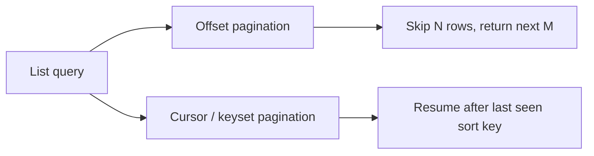

# Pagination Strategies

## 1. Overview

Pagination is the practice of returning large result sets in smaller chunks rather than as one unbounded response.

That seems like a presentation concern until the dataset grows or becomes highly dynamic.

At that point, pagination becomes a system-design topic because it shapes:

- query cost
- index usage
- response size
- client traversal semantics
- consistency under concurrent writes

The naive view is:

- pagination is just `page` and `limit`

That works for some applications and breaks badly for others.

For example:

- offset pagination can become very expensive on large datasets
- concurrent inserts can cause items to shift between pages
- clients may see duplicates or miss results while traversing

So pagination is not just about slicing output.

It is about deciding how clients move through a changing ordered dataset and what guarantees the system does or does not provide during that movement.

When designed well, pagination keeps queries bounded, predictable, and usable.

When designed poorly, it creates:

- unstable client experiences
- expensive database scans
- confusing duplicates or missing items
- accidental coupling to internal ordering details

## 2. The Core Problem

Large list endpoints are expensive in multiple dimensions:

- they can scan too much data
- they can allocate too much memory
- they can return too much over the network
- they can become unstable if the dataset changes while a user is traversing it

Suppose a client requests:

- orders
- notifications
- activity feed entries
- search results

and there are millions of rows.

Returning everything is impractical.

But once the system returns only a subset, it must answer new questions:

- how does the client ask for the next chunk
- what ordering defines the next chunk
- what happens if new rows appear between requests
- can the client jump to an arbitrary page

That is the real pagination problem:

How does the system bound result size while still giving clients a traversal model that is performant, understandable, and correct enough for the workload?

## 3. Visual Model

What to notice:

- offset and cursor pagination answer "what comes next" in very different ways
- offset is simpler for clients but more expensive and less stable at scale
- cursor approaches depend heavily on good ordering keys

## 4. Formal Statement

Pagination strategy is the policy by which a system divides a result set into bounded segments and defines how clients request successive segments over a dataset that may be static or changing.

A serious pagination design has to define:

- ordering
- page boundary representation
- traversal token or offset
- consistency expectations across pages
- interaction with filtering and sorting

The most important point is that pagination is not just a response format.

It is an access-path contract.

## 5. Key Terms

### 5.1 Offset Pagination

The client requests results by position count, such as:

- `offset=100&limit=20`

### 5.2 Page Number Pagination

This is a human-friendly form of offset-based pagination:

- `page=6&page_size=20`

It usually maps to offset internally.

### 5.3 Cursor Pagination

The client continues from a token representing a position in the ordered result stream.

### 5.4 Keyset Pagination

A cursor style that uses one or more ordered field values directly, such as:

- `created_at < X`
- or `(created_at, id) < (...)`

### 5.5 Stable Sort Key

A deterministic ordering field or field combination used to define safe traversal.

### 5.6 Page Drift

Page drift occurs when inserts, updates, or deletes move items between pages while the client is traversing.

### 5.7 Opaque Cursor

A cursor encoded so the client does not rely on internal ordering mechanics directly.

## 6. Why the Constraint Exists

The constraint exists because datasets are often changing while clients page through them.

Imagine an activity feed ordered by newest first.

A user requests page 1.

Before they request page 2, five new items arrive.

With naive offset pagination:

- what used to be item 21 may now be item 26
- the client may see duplicates
- or the client may skip items

Now consider a huge admin table.

Asking for page 5000 with offset pagination may require the database to skip a huge number of rows before returning the next 20.

So pagination is constrained by two realities:

- datasets can be large
- datasets can change during traversal

This is why the pagination strategy must reflect both scale and mutability, not just API convention.

## 7. Main Variants or Modes

### 7.1 Offset Pagination

The client specifies how many rows to skip and how many to return.

Strengths:

- easy to understand
- easy to expose in APIs
- supports intuitive arbitrary page jumps

Costs:

- expensive for large offsets
- unstable under frequent inserts or deletes
- vulnerable to page drift

Offset is often fine for small or mostly static datasets.

### 7.2 Cursor Pagination

The client provides a cursor that resumes from a previous position.

Strengths:

- more scalable for large datasets
- more stable under change
- avoids large skip cost

Costs:

- less intuitive than page numbers
- harder to support arbitrary page jumps
- depends on stable sorting

### 7.3 Keyset Pagination

The system uses ordered field values directly to define the next page boundary.

Strengths:

- efficient index usage
- very good for time-ordered or feed-like data

Costs:

- requires carefully chosen sort keys
- more constrained sorting behavior

### 7.4 Snapshot or Consistent-View Pagination

Some systems paginate over a stable snapshot or a query-consistent view.

Strengths:

- reduced page drift
- stronger traversal consistency

Costs:

- more expensive state retention or transactional support
- often not necessary for ordinary product experiences

### 7.5 Hybrid Approaches

Some products use:

- offset for small admin datasets
- cursor for high-volume public feeds

This is often the right practical answer because not all pagination surfaces have the same requirements.

## 8. Supporting Mechanisms and Related Ideas

### 8.1 Indexing

Pagination works well only when the underlying order and filter can be supported efficiently by indexes.

Good pagination without good indexing is usually fake performance.

### 8.2 Sort Key Design

Stable traversal usually requires deterministic ordering.

If two rows share the same timestamp, for example, a tiebreaker such as ID may be needed.

### 8.3 Filtering and Search

Pagination semantics change when filters are applied.

The system must define:

- whether the cursor is tied to a specific filter set
- whether sort order changes invalidate cursors

### 8.4 API Contract Design

The response needs to make continuation clear, often through:

- `next_cursor`
- `has_more`
- page metadata

### 8.5 Consistency Expectations

Not every client needs the same traversal guarantees.

Feeds, dashboards, search results, and export workflows may all need different pagination semantics.

## 9. Real-World Examples

### Activity Feeds

Feeds are usually better served with cursor or keyset pagination because:

- new items arrive constantly
- users care about stable forward traversal
- deep offset scans are wasteful

### Admin Dashboards

An internal admin table with modest size may use offset pagination because:

- random page jumps are useful
- data volume is manageable
- slight drift is acceptable

### Public APIs

Well-designed public APIs often expose opaque cursors so clients do not become tightly coupled to internal ordering and storage details.

### Search Results

Search systems may mix pagination with ranking and mutable relevance. That makes stable traversal more complex and often pushes teams toward cursor-like continuation tokens rather than naive offsets.

## 10. Common Misconceptions

### "Pagination Is a Frontend Concern"

Wrong.

It directly affects:

- query shape
- storage cost
- consistency behavior
- API semantics

### "Offset Pagination Is Fine Everywhere"

Only on smaller, less dynamic datasets or where its tradeoffs are acceptable.

### "Cursor Pagination Is Harder for No Reason"

It exists because large mutable datasets make offset both expensive and unstable.

### "A Cursor Automatically Guarantees Correctness"

Not by itself.

The cursor still depends on:

- sort stability
- filter stability
- query contract clarity

### "Page Numbers Are Always Better UX"

Sometimes. In feed-like or continuously changing data, page numbers can imply stability that the system does not truly provide.

## 11. Design Guidance

The best design question is:

How do users or systems actually move through this dataset, and how much instability can they tolerate while doing so?

### Strong Fits for Offset

- small datasets
- mostly static administrative views
- interfaces where random page access matters

### Strong Fits for Cursor or Keyset

- feeds
- timelines
- very large datasets
- APIs with continuous inserts
- list views where stable continuation matters more than jumping to page 19

### Prefer

- deterministic ordering
- opaque cursors for public APIs
- explicit documentation of what sort/filter combinations are valid
- tie-breaker fields when order is not naturally unique

### Questions Worth Asking

- how large can the dataset get
- how often does it mutate
- do clients need random page jumps or simply next/previous traversal
- what query/index combination actually supports the pagination efficiently

### Practical Heuristic

If clients mostly move forward through a large changing dataset, cursor or keyset pagination is usually the right default.

If the dataset is smaller and human navigation by page number matters, offset may still be the better trade.

## 12. Reusable Takeaways

- Pagination is an access-path contract, not just a response-format choice.
- Offset favors simplicity and random access; cursor favors scale and stability.
- Stable ordering is central to good pagination design.
- Changing datasets make traversal semantics a consistency problem.
- Good pagination depends heavily on matching query strategy to indexes and user behavior.

## 13. Summary

Pagination strategies determine how clients move through large result sets without forcing the system to return everything at once.

The benefit is bounded queries and usable traversal through big datasets.

The tradeoff is that the system must choose what kind of traversal semantics it wants to promise:

- convenience
- stability
- scale
- or some balance of the three

That choice should be driven by the dataset and the user workflow, not by habit.
