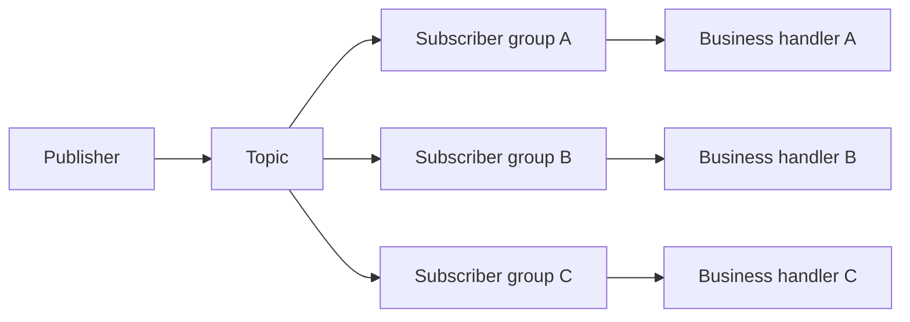

# Pub/Sub

## 1. Overview

Pub/sub, short for publish/subscribe, is a messaging pattern in which producers publish messages to a topic or channel and consumers receive them because they subscribed to that logical stream, not because the producer knows about them directly.

The simplest and most useful intuition is:

One producer should not need to know every consumer that cares.

That sounds like a modest convenience. In practice, it changes system structure significantly.

Pub/sub is one of the main ways systems implement:

- fan-out
- loose coupling
- asynchronous reaction
- extension without producer rewrites

At a high level, pub/sub separates three concerns:

- producing events
- distributing them
- consuming them

That separation is valuable because it lets producers stay focused on generating facts while consumers evolve independently.

But pub/sub is often explained too casually.

People say:

- "it is just messaging"
- "it is just a queue with topics"
- "just publish an event and subscribe"

Those simplifications miss the hard parts:

- delivery guarantees
- ordering
- subscription state
- replay
- contract evolution
- lagging or broken consumers

Pub/sub reduces one kind of coupling and introduces another kind:

- less direct runtime coupling
- more dependence on event contracts and operational messaging behavior

That is why pub/sub is so useful in growing distributed systems and so easy to misuse when treated as architectural decoration.

## 2. The Core Problem

Suppose one business action should trigger multiple downstream behaviors.

Examples:

- order created
- user signed up
- invoice paid
- file uploaded

Without pub/sub, the producer has two common choices.

It can call each consumer directly:

- email service
- analytics service
- fulfillment service
- fraud service

Or it can push to one queue that one worker group consumes.

Direct calls create strong producer coupling.

One-to-one queues handle asynchronous work, but they do not solve one-to-many distribution well.

So the real pub/sub problem is:

How can a system distribute one produced event to multiple interested consumers without forcing the producer to know those consumers individually or manage their lifecycles directly?

That matters because as the number of consumers grows, direct integration makes the producer harder to evolve.

Every new consumer becomes:

- a code change
- a dependency
- a failure surface
- a rollout concern

Pub/sub exists because many systems need extensible fan-out, not just deferred processing.

## 3. Visual Model

What to notice:

- the producer publishes once and does not directly invoke each consumer
- the topic becomes the distribution boundary
- each subscriber group can progress independently, which is powerful and operationally significant

## 4. Formal Statement

Pub/sub is a messaging model in which producers publish messages to a logical topic, channel, or stream and subscribers receive those messages because of their subscription relationship rather than because the producer directly addressed them.

A serious pub/sub design has to define:

- how topics are created and owned
- whether subscribers are durable or ephemeral
- what delivery semantics exist
- what ordering guarantees exist
- whether replay is possible
- how consumer lag is handled
- how message contracts evolve

The critical design point is this:

Pub/sub is about distribution semantics as much as transport.

The interesting question is not "can the system send messages."

It is:

How many consumers can react independently to the same event, and under what guarantees?

## 5. Key Terms

### 5.1 Publisher

The publisher is the producer of the message or event.

In good designs, the publisher emits a meaningful fact and does not need to manage the downstream consumer list.

### 5.2 Subscriber

A subscriber is a consumer registered to receive messages from a topic or channel.

Different subscribers can consume the same event for different reasons.

### 5.3 Topic or Channel

The logical destination that groups related messages.

It is the abstraction through which publishers and subscribers are decoupled.

### 5.4 Fan-Out

Fan-out is the delivery of one message to multiple independent subscribers.

This is the core value pub/sub provides over simpler queue patterns.

### 5.5 Durable Subscriber

A durable subscriber maintains consumption state so it can continue after downtime.

This is common when missing events is unacceptable.

### 5.6 Ephemeral Subscriber

An ephemeral subscriber receives messages only while connected or actively attached.

This is useful for transient notification or live-feed scenarios.

### 5.7 Replay

Replay means the subscriber can consume previously published messages again, either for recovery or reprocessing.

Not all pub/sub systems support replay equally.

### 5.8 Consumer Lag

Lag is the delay or backlog between publication and subscriber processing.

It is one of the most important operational signals in pub/sub systems.

## 6. Why the Constraint Exists

The constraint exists because fan-out is not free.

If one producer emits an event and many consumers receive it, the system must decide:

- how the event is stored
- how subscriptions are tracked
- how redelivery works
- whether slow consumers block fast ones
- what happens when one subscriber is down

These decisions are easy to ignore when people only think about the happy path.

Imagine an order service publishing `order_created`.

The consumers may include:

- email
- analytics
- fulfillment
- fraud
- customer timeline

Now ask:

- what if analytics is slow
- what if email is down
- what if fulfillment must not miss any messages
- what if fraud needs replay after a bug fix

These are not side questions. They are the actual pub/sub design.

The constraint exists because one-to-many asynchronous delivery makes systems more extensible only by accepting more messaging semantics and more operational state.

## 7. Main Variants or Modes

### 7.1 Durable Topic Subscriptions

Subscribers retain progress and can recover from downtime.

Strengths:

- good for business-significant events
- supports delayed processing
- supports recovery after outage

Costs:

- more state to manage
- lagging consumers accumulate backlog
- replay and retention policies become important

### 7.2 Ephemeral Broadcast

Subscribers receive messages only while actively connected.

Strengths:

- simpler operational model
- useful for transient notifications
- good for live-update or presence-style workloads

Costs:

- missed data is typically lost
- poor fit for critical state transitions

### 7.3 Partitioned Ordered Streams

Some pub/sub systems preserve ordering within a partition or key.

Strengths:

- useful when per-entity order matters
- enables consistent reconstruction of one entity's event sequence

Costs:

- global ordering is usually unavailable or expensive
- hot keys can become bottlenecks
- ordering may reduce parallelism

### 7.4 Consumer Groups

Sometimes a logical subscriber is implemented by a group of workers that share the work.

Strengths:

- scaling a single downstream function
- parallel processing within one subscriber role

Costs:

- work distribution must still preserve intended semantics
- ordering constraints may restrict concurrency

### 7.5 Replayable Event Streams

Some systems retain messages long enough that subscribers can reprocess from earlier offsets or checkpoints.

Strengths:

- recovery from consumer bugs
- backfill and reindexing support
- stronger operational debugging

Costs:

- retention cost
- replay-safe consumer behavior required

## 8. Supporting Mechanisms and Related Ideas

### 8.1 Message Queues

Queues are usually about one logical consumer path or one competing-consumer pattern.

Pub/sub is about one-to-many distribution.

Some platforms support both under one product, but the semantics are different.

### 8.2 Event-Driven Architecture

Pub/sub is often one of the transport patterns underlying event-driven architecture.

But event-driven architecture is broader because it also includes how events are modeled and how workflows emerge from them.

### 8.3 Idempotent Consumers

If the pub/sub system redelivers or supports replay, consumers must handle duplicate messages safely.

### 8.4 Schema Evolution

Because many subscribers may depend on a topic, changing message shape becomes a contract-management problem, not just a producer refactor.

### 8.5 Outbox Pattern

Many reliable pub/sub producers use an outbox pattern so that publishing is aligned with committed source-of-truth state.

### 8.6 Observability

A mature pub/sub system monitors:

- publish success
- subscriber lag
- redelivery rate
- dead-letter rate
- consumer error rate
- per-topic throughput

Without these, teams often discover broken consumers only when downstream business behavior is already wrong.

## 9. Real-World Examples

### Order Created Fan-Out

An order service publishes one `order_created` event.

Independent subscribers then:

- send confirmation email
- update analytics
- begin fulfillment
- run fraud checks

This is a strong fit for pub/sub because the producer should not need to know or wait on all those concerns.

### Audit and Observability Streams

A service publishes important domain events that multiple consumers use differently:

- analytics pipelines
- audit storage
- operational dashboards
- compliance feeds

Pub/sub works well here because one source event can support many downstream needs without producer rewrites.

### Notification Platforms

A notification domain event may fan out to subscribers that render:

- push notification
- email
- in-app feed entry
- SMS

This illustrates the value of one business event driving many channel-specific consumers.

### Internal Platform Signals

Platform systems may publish:

- deployment completed
- secret rotated
- policy violation detected
- resource provisioned

and allow several platform tools to react independently.

This is useful when operational extensibility matters and no single service should be hard-coded with every downstream integration.

## 10. Common Misconceptions

### "Pub/Sub Is Just a Queue with a Different Name"

Wrong.

The defining feature is one-to-many distribution and subscriber independence, not merely asynchronous transport.

### "Adding Subscribers Is Free"

Wrong.

It is cheap for the publisher's code path and not free for the system overall.

More subscribers mean:

- more contract dependency
- more lag surfaces
- more failure modes
- more operational load

### "Pub/Sub Eliminates Coupling"

It reduces direct producer-to-consumer runtime coupling.

It does not remove:

- semantic coupling
- schema coupling
- operational dependency on the messaging platform

### "Ordered Topics Solve All Consistency Problems"

Wrong.

Ordering within a topic or partition does not eliminate:

- duplicates
- replay complexity
- inter-topic race conditions
- consumer correctness issues

### "If the Publisher Succeeded, the System Is Done"

Often wrong.

In pub/sub designs, the producer may be done while critical downstream subscribers are still lagging or failing.

## 11. Design Guidance

Use pub/sub when one event needs to drive multiple independent downstream behaviors and you want producers to stay decoupled from subscriber evolution.

### Strong Fits

- one-to-many event distribution
- subscribers owned by different teams
- eventual consistency acceptable for many effects
- extensibility matters more than immediate end-to-end synchronization

### Weak Fits

- a single consumer is the only real audience
- strict synchronous user-path completion is required
- global ordering across all events is assumed
- teams are not prepared to operate backlog, replay, and consumer lag

### Questions Worth Asking

- how many subscriber groups truly need this event
- should those subscribers be durable
- what ordering matters and at what scope
- can subscribers replay safely
- how will consumer lag be observed
- who owns the event contract

### Practical Heuristic

If the producer is starting to accumulate direct knowledge of many unrelated consumers, pub/sub is usually a sign of healthy decoupling.

If the topic exists only to support one tightly coupled downstream workflow, a queue or direct integration may be clearer.

## 12. Reusable Takeaways

- Pub/sub is fundamentally about one-to-many distribution, not just asynchronous transport.
- It reduces direct producer coupling while increasing dependence on event contracts and messaging operations.
- Durable subscribers, replay, ordering, and lag are the real design questions in pub/sub systems.
- More subscribers make the system more extensible and more operationally complex.
- Idempotency and schema discipline are essential for production-grade pub/sub.
- Pub/sub is strongest where many consumers need the same fact for different reasons.

## 13. Summary

Pub/sub lets producers publish one event to a logical topic and allows multiple subscribers to react independently without direct producer awareness of each consumer.

The gain is extensible fan-out and looser runtime coupling.

The tradeoff is that the system must now manage:

- subscriber state
- lag
- delivery semantics
- event contracts

When treated as a real distribution model rather than just "a topic in the broker," pub/sub becomes one of the most powerful and most widely useful messaging patterns in distributed systems.
