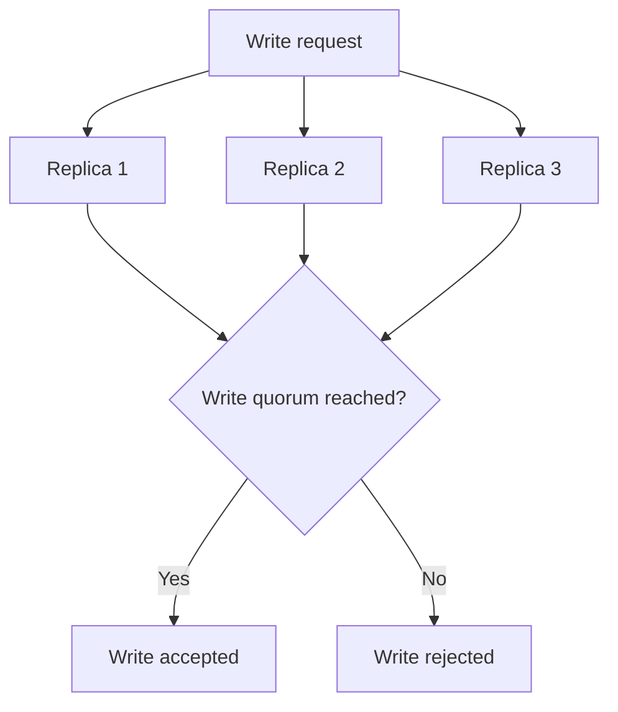

# Quorum

## 1. Overview

Quorum is a coordination technique used in replicated systems to determine how many participants must take part in an operation before that operation is considered valid.

At the simplest level, quorum answers:

How many replicas are enough?

That question matters because replicated systems are full of tradeoffs.

If every operation requires every replica:

- correctness can be strong
- latency is high
- availability is fragile

If any single replica is enough:

- operations are fast
- availability is high
- correctness can degrade badly

Quorum exists in the space between those extremes.

It gives the system a principled rule for deciding when reads or writes have contacted enough of the replicated set to carry useful guarantees.

This matters across many systems:

- leaderless datastores
- consensus-backed systems
- metadata stores
- replicated databases

Quorum is one of the most reused ideas in distributed systems because it lets the system convert a loose collection of replicas into a group with meaningful overlap and safety properties.

But quorum is also often oversimplified.

People memorize:

- `R + W > N`

and stop there.

That formula is useful and not the whole story.

Real quorum behavior also depends on:

- failure mode
- replica freshness
- ordering
- leader or leaderless design
- what the system calls success

So quorum is best understood as a replica-participation policy with important correctness implications, not merely a formula.

## 2. The Core Problem

Replication creates multiple copies of data or state.

That improves:

- durability
- availability
- read scale

But replication does not by itself answer:

- when a write should count as committed
- when a read should count as trustworthy
- how many failures can be tolerated
- what happens during partition

Suppose three replicas exist.

If one write is acknowledged by only one replica and a later read checks a different one, the system can easily return stale data.

If every write requires all three replicas and one is down, writes stop.

So the real quorum problem is:

How can a replicated system require enough participation to preserve useful correctness while still tolerating some failure and avoiding the cost of full participation every time?

That is the heart of quorum design.

## 3. Visual Model

What to notice:

- the system does not necessarily need every replica
- it does need a chosen threshold of replica participation
- that threshold is the foundation of the system's read/write behavior under failure

## 4. Formal Statement

In a replicated system with `N` replicas, a quorum is the minimum number of participating replicas required for a read or write operation to be accepted under the system's policy.

Common notation:

- `N`: total replicas
- `W`: replicas required for a successful write
- `R`: replicas required for a successful read

One well-known quorum condition is:

- `R + W > N`

This creates overlap between successful reads and successful writes, which increases the chance that successful reads intersect recent successful writes.

But quorum design is broader than that formula.

A serious quorum system also needs to define:

- which replicas count
- how freshness is evaluated
- what happens under partition
- whether a leader exists
- whether acknowledgments imply ordering or only storage

## 5. Key Terms

### 5.1 Read Quorum

The number of replicas that must participate in a read before the read is considered valid.

### 5.2 Write Quorum

The number of replicas that must acknowledge a write before the write is considered successful.

### 5.3 Majority Quorum

A majority quorum requires more than half of the replicas.

For `N = 3`, majority is `2`.

### 5.4 Overlap

Overlap means a successful read and successful write share at least one replica.

This is the intuition behind `R + W > N`.

### 5.5 Minority Partition

A subset of replicas that does not contain enough members to satisfy quorum.

### 5.6 Freshness

Freshness refers to how likely a read is to observe the latest committed or successful write.

### 5.7 Tunable Quorum

A system where `R` and `W` can be configured differently for workload tradeoffs.

### 5.8 Availability Threshold

How many failures the system can tolerate before quorum can no longer be reached for a given operation.

## 6. Why the Constraint Exists

The constraint exists because replicated state must still produce one coherent answer often enough to be useful.

Suppose a system has three replicas:

- R1
- R2
- R3

If writes require acknowledgment from only one replica:

- `W = 1`

and reads also use only one replica:

- `R = 1`

then the system is fast and highly available, but a read may easily contact a replica that has not seen the most recent write.

Now suppose writes require all three replicas:

- `W = 3`

That may improve confidence in replicated durability, but one failed replica blocks progress.

Quorum exists because the system wants a threshold that is:

- more trustworthy than one replica
- less fragile than all replicas

That threshold creates overlap and failure tolerance at the same time.

The system is explicitly choosing how much participation is enough for useful safety.

## 7. Main Variants or Modes

### 7.1 Majority Quorum

This is one of the most common choices, especially in coordination systems and strongly consistent leader-based systems.

Strengths:

- strong safety intuition
- simpler reasoning about uniqueness of authority
- avoids conflicting majorities in the same replica set

Costs:

- minority partitions cannot continue
- latency depends on reaching a majority

### 7.2 Tunable Quorum

Some systems let operators choose read and write thresholds independently.

Examples:

- low `R`, high `W`
- high `R`, low `W`

Strengths:

- can optimize for read-heavy or write-heavy workloads
- flexible availability/consistency tradeoffs

Costs:

- easier to misconfigure
- guarantees become workload- and implementation-sensitive

### 7.3 Read-One / Write-All

Reads are fast, writes are very strict.

Strengths:

- very fresh reads if writes succeed

Costs:

- writes are fragile and slow

### 7.4 Write-One / Read-All or Similar Extremes

Some extreme configurations optimize one side very aggressively.

These are specialized choices and often unsuitable for general-purpose systems.

### 7.5 Quorum in Leader-Based Systems

Even if ordinary reads and writes pass through a leader, quorum may still matter for:

- electing a leader
- committing log entries
- validating membership changes

This is important because quorum is not only a leaderless concept.

## 8. Supporting Mechanisms and Related Ideas

### 8.1 Replication

Quorum only matters because replicated state exists.

Without replication, there is nothing to overlap.

### 8.2 Leader Election

Leader election often uses majority quorum to ensure only one sufficiently supported leader can be valid at a time.

### 8.3 Consistency Models

Quorum improves the chance of seeing fresh data, but consistency still depends on:

- ordering
- conflict handling
- application of writes

### 8.4 Network Partitions

Partition behavior is where quorum becomes operationally decisive.

Minority groups often lose the ability to make progress safely.

### 8.5 Versioning and Conflict Resolution

In leaderless systems especially, quorum overlap is not enough by itself. Versioning and merge rules still matter.

## 9. Real-World Examples

### Replicated Databases

Some leaderless or tunable-consistency databases use read and write quorums so clients can choose between:

- lower latency
- stronger overlap with recent writes

This is a practical example of quorum as an adjustable participation policy.

### Metadata and Coordination Stores

Systems that manage cluster membership or metadata often require majority quorum before accepting changes.

This helps avoid two isolated minority groups both acting as if they are authoritative.

### Multi-Replica Write Commit

A system may wait for acknowledgments from two out of three replicas before confirming a write.

That is quorum in its most operational form:

choosing when a write is "durable enough" to count.

### Leader-Based Consensus Systems

Even though clients talk to a leader, the leader may still need quorum support to commit state safely or remain valid.

## 10. Common Misconceptions

### "Quorum Means Everyone Agrees"

Wrong.

Quorum means enough participants agree or participate under the chosen rule.

### "`R + W > N` Solves Everything"

Wrong.

It provides overlap, not complete correctness.

Freshness still depends on:

- versioning
- propagation order
- conflict resolution

### "Quorum Is Only for Leaderless Systems"

Wrong.

Leader-based systems rely on quorum heavily for leadership and commit safety.

### "Majority Quorum Is Always Best"

Often a good default, not universally best.

Different workloads sometimes justify different read/write thresholds.

### "If Quorum Is Reached, Reads Are Always Fresh"

Not automatically.

The system still needs the right write-ordering and replica-application semantics.

## 11. Design Guidance

The best design question is:

What level of replica participation is required for this system's correctness expectations, and what failures must still allow progress?

### Prefer

- majority quorum for correctness-sensitive coordination
- tunable quorum only when the team understands the tradeoffs well
- clear documentation of what successful read or write actually means

### Be Careful About

- tuning for latency without understanding consistency implications
- treating quorum math as a complete correctness proof
- ignoring freshness and replica state semantics

### Questions Worth Asking

- what failures should reads survive
- what failures should writes survive
- how stale can reads be
- what does an acknowledgment from a replica actually guarantee

### Practical Heuristic

If the system needs safe authority or commit decisions under failure, majority quorum is often the safest mental and engineering default.

## 12. Reusable Takeaways

- Quorum is a replica-participation rule for deciding when reads and writes count.
- It sits between the extremes of "one replica is enough" and "everyone must respond."
- Majority quorum is common because it gives strong safety intuition under partition.
- Overlap helps freshness, but overlap alone is not full correctness.
- Quorum matters in both leaderless and leader-based systems.

## 13. Summary

Quorum is a way for replicated systems to decide how many participants are enough to make progress safely.

The benefit is that the system gains a principled balance between correctness, latency, and failure tolerance.

The tradeoff is that the chosen threshold directly shapes:

- availability under failure
- write and read latency
- freshness expectations

That is why quorum is one of the most foundational coordination tools in distributed systems.
