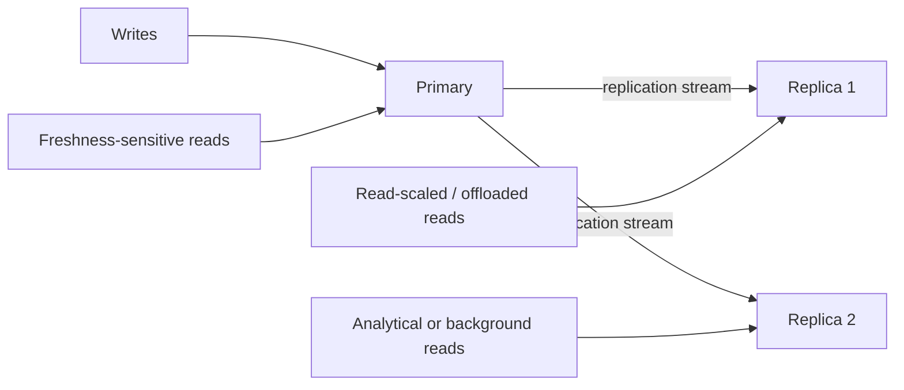

# Read Replicas

## 1. Overview

Read replicas are copies of a primary database used mainly to serve some portion of read traffic rather than accept authoritative writes.

At first glance, this sounds like a simple scaling idea:

- writes go to the primary
- reads go to the replicas

That is directionally correct and dangerously incomplete.

Read replicas are not just "more databases for reads."

They introduce a new architectural boundary in the system:

- the boundary between the latest committed truth on the primary
- and the potentially delayed view visible on replicas

That boundary affects:

- read consistency
- routing logic
- user expectations
- failover design
- operational observability

This is why read replicas are one of the most common scaling patterns and one of the most common sources of subtle data-read bugs.

When designed well, read replicas:

- offload expensive reads from the primary
- isolate analytical or background workloads
- improve regional read performance
- provide some resilience options

When designed poorly, they create:

- stale reads in the wrong user paths
- confusing read-after-write behavior
- failover surprises
- overloaded replicas that are treated like free capacity

So the real topic is not just "how to scale reads."

It is:

How can the system separate some read traffic from the primary without violating the consistency expectations that actually matter?

## 2. The Core Problem

A primary database often ends up serving many different kinds of work:

- transactional writes
- transactional reads
- list views
- dashboards
- reports
- search extraction
- background jobs

Those workloads are not equal.

Some require:

- fresh state
- transactional semantics
- low contention

Others mainly require:

- throughput
- long scans
- analytical flexibility
- asynchronous extraction

If everything hits the primary, several problems appear:

- primary CPU and I/O contention
- longer tail latency for user-facing operations
- reduced write headroom
- increased incident risk during reporting or heavy reads

Read replicas exist because many systems become read-heavy or read-diverse before they become truly write-bound.

But once replicas are introduced, the system must decide:

- which reads can tolerate lag
- which reads must stay on the primary
- how lag is observed
- what happens during failover

That is the real read-replica design problem.

## 3. Visual Model

What to notice:

- the primary is still the authoritative write path
- replicas are useful only if the system classifies reads intelligently
- replica lag means "all reads can go to replicas" is usually the wrong mental model

## 4. Formal Statement

A read replica is a secondary copy of a database that receives changes from a primary through replication and is used mainly to serve reads, offload workloads, or provide geographically or operationally distinct read paths.

A serious read-replica design has to define:

- replication mode
- expected lag behavior
- read routing policy
- freshness-sensitive exceptions
- promotion and failover rules
- lag monitoring and load management

The key architectural fact is:

Read replicas improve read scalability by accepting some separation between where writes become authoritative and where reads are served.

Once that separation exists, the system must explicitly manage consistency expectations.

## 5. Key Terms

### 5.1 Primary

The primary is the node that accepts authoritative writes.

It is the canonical source of the latest committed state in typical primary-replica setups.

### 5.2 Replica

A replica is a copy of the primary's data that is kept in sync through replication and used for reads, failover, or specialized workloads.

### 5.3 Replica Lag

Replica lag is the delay between a write being committed on the primary and that write becoming visible on the replica.

This is the defining tradeoff of most read-replica strategies.

### 5.4 Read-After-Write Consistency

This is the property that a client can read its own successful write immediately afterward.

Read replicas often weaken this unless routing is designed carefully.

### 5.5 Synchronous Replication

The primary waits for one or more replicas before confirming a write.

This reduces lag but increases write latency and can reduce availability.

### 5.6 Asynchronous Replication

The primary acknowledges the write before replicas fully catch up.

This improves write performance and availability at the cost of stale reads and failover complexity.

### 5.7 Replica Promotion

Replica promotion is the act of turning a replica into the new primary during failover.

## 6. Why the Constraint Exists

Replicas receive state after it is written.

That sounds obvious and is the entire reason the tradeoff exists.

If the primary commits a write and the replica sees it slightly later, then any read routed to the replica in that gap can observe stale data.

That means one write path now creates multiple read realities for a short period:

- latest state on the primary
- delayed state on one or more replicas

In some workflows, this is harmless.

Examples:

- background analytics
- recommendation extraction
- product browsing with acceptable mild staleness

In others, it is dangerous.

Examples:

- user saves profile and immediately reloads it
- account balance display after transfer
- order confirmation page after purchase

The constraint exists because read scaling through replication is only possible by copying data over time, and that copy process has latency, queueing, and failure behavior of its own.

The system cannot pretend replicas are always the same thing as the primary.

## 7. Main Variants or Modes

### 7.1 Asynchronous Read Replicas

The primary acknowledges writes before replicas fully catch up.

Strengths:

- common and operationally practical
- improves primary write throughput and availability
- scales reads well

Costs:

- stale reads possible
- promotion risk during failover if replicas are behind

This is the most common real-world replica model.

### 7.2 Synchronous Read Replicas

The primary waits for replica acknowledgment before confirming writes.

Strengths:

- stronger visibility guarantees
- tighter read-after-write semantics in some designs

Costs:

- higher write latency
- reduced write availability if replicas are slow or unreachable

This is usually chosen only when consistency requirements justify the cost.

### 7.3 Semi-Synchronous or Mixed Modes

Some systems wait for a subset of replicas or use different durability policies under different conditions.

Strengths:

- more flexible tradeoffs

Costs:

- more nuanced behavior to reason about
- harder operational understanding

### 7.4 Purpose-Specific Replicas

Not all replicas serve the same function.

Some may be designated for:

- reporting
- search extraction
- regional reads
- machine learning feature generation

Strengths:

- workload isolation
- better operational predictability

Costs:

- more routing and topology complexity

### 7.5 Regional Read Replicas

Replicas can be placed nearer to users in another region.

Strengths:

- lower read latency for distant users

Costs:

- cross-region replication lag
- more complex failover and freshness reasoning

## 8. Supporting Mechanisms and Related Ideas

### 8.1 Read Routing Policy

The system needs explicit rules for:

- which requests can go to replicas
- which requests must go to the primary
- when to pin a user temporarily to primary after a write

This policy often matters more than the replication technology itself.

### 8.2 Lag Monitoring

Replica lag must be measured and surfaced operationally.

Useful signals include:

- seconds behind primary
- log position difference
- apply delay
- replica query saturation

Without lag visibility, teams often discover replica problems only through confusing stale-user reports.

### 8.3 Read-After-Write Strategies

Systems commonly preserve read-after-write in selected flows by:

- routing immediate follow-up reads to the primary
- using session stickiness after mutations
- tracking version or timestamp and enforcing minimum freshness

These are often more practical than demanding strong freshness from every replica read.

### 8.4 Failover Design

Replicas are frequently considered failover candidates.

That means the system must know:

- how far behind they are
- whether the old primary is fenced
- how clients are redirected

A read replica is not automatically a safe new primary.

### 8.5 Query Isolation

One of the biggest advantages of replicas is isolating expensive read workloads from primary-path transactions.

But if replicas become overloaded with too many mixed workloads, they lose that benefit.

## 9. Real-World Examples

### Reporting Offload

A transactional primary supports order placement and payment updates.

Heavy reporting queries run on replicas so the primary remains focused on latency-sensitive writes and small transactional reads.

This is one of the cleanest uses of read replicas because reporting often tolerates mild staleness.

### Regional Read Serving

A global product keeps one write primary in one region and exposes replicas closer to users in other geographies.

This improves read latency for:

- profile views
- catalog browsing
- history pages

but usually requires careful handling of immediate post-write reads.

### Search and Recommendation Feed Extraction

Background systems reading large portions of the dataset often consume replica data so they do not compete directly with the write path.

This is a strong fit when exact freshness is less important than isolating heavy scans from critical traffic.

### Admin or Support Dashboards

Support tools sometimes use replicas because:

- they need lots of reads
- strict read-after-write is not required for every screen

This can work well if the product is honest about freshness expectations.

## 10. Common Misconceptions

### "Read Replicas Scale the Database"

Only partly.

They scale reads, not writes, and even read scaling comes with lag and routing complexity.

### "Replica Reads Are Equivalent to Primary Reads"

Wrong.

They may be equivalent enough for some workflows and not for others.

### "Replica Lag Is Usually Negligible"

Sometimes it is. Under load, network issues, or cross-region replication, it can become operationally significant very quickly.

### "Replicas Automatically Improve Availability"

Not by themselves.

They can help with failover and read continuity, but only if promotion and routing are designed safely.

### "All Reads Should Use Replicas Once They Exist"

Wrong.

Some reads require freshness, transactional context, or write-path coordination and should stay on the primary.

## 11. Design Guidance

The best question is not:

Should we add replicas?

The better question is:

Which read workloads should stop competing with the primary, and what freshness guarantees do those workloads truly need?

### Strong Fits

- reporting
- background extraction
- geographically distant read traffic
- high-volume browse or history pages that tolerate mild staleness

### Weak Fits

- immediate post-write confirmation flows
- balance or critical state verification
- workflows where users must see the latest mutation instantly

### Prefer

- explicit read routing policy
- clear freshness-sensitive exceptions
- replica lag dashboards and alerts
- purpose-specific replicas for workload isolation

### Questions Worth Asking

- what user flows can tolerate stale reads
- how will the application preserve read-after-write where needed
- how far behind can a failover candidate be
- what workloads should never share the same replica

### Practical Heuristic

If a read path is mainly about offloading expensive or geographically distant reads and can tolerate slight delay, a replica is a strong candidate.

If the read path is part of the immediate write confirmation experience, defaulting it to a replica is usually a mistake.

## 12. Reusable Takeaways

- Read replicas scale reads by separating read-serving from the primary write path.
- Replica lag is the central tradeoff and must be treated as a first-class behavior.
- Routing policy matters as much as replication itself.
- Some reads should remain on the primary for correctness and user experience.
- Replicas are valuable for workload isolation, not just aggregate throughput.
- A replica is not automatically a safe failover primary without freshness and promotion checks.

## 13. Summary

Read replicas let systems offload and isolate read traffic from the primary database, often improving scale and operational flexibility.

The benefit is lower primary pressure and more specialized read capacity.

The tradeoff is that reads are no longer uniform:

- some are fresh
- some are delayed
- some require routing discipline to stay correct

Good read-replica design is therefore not just about adding copies. It is about making the consistency boundary between primary and replica explicit and intentional.
