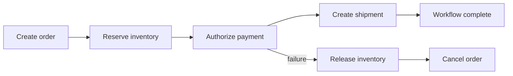

# Saga Pattern

## 1. Overview

The saga pattern is a way to coordinate multi-step business workflows across multiple services without requiring one large distributed ACID transaction.

Instead of trying to make every participating system commit atomically together, a saga breaks the workflow into a series of local steps and defines how the system should recover if a later step fails.

That is the technical description.

The more useful description is this:

A saga is how a distributed system admits that one global transaction is either unavailable or too expensive, and then replaces it with explicit workflow logic and business-aware compensation.

This matters because many modern systems split ownership across services:

- orders live in one service
- payments in another
- inventory in another
- shipping in another

The business process still expects coherent outcomes:

- do not ship without payment
- do not charge if inventory fails
- do not leave the workflow half-finished forever

Sagas exist because the infrastructure usually cannot make these systems behave like one giant database transaction safely and cheaply.

When designed well, a saga gives a distributed workflow:

- clear step boundaries
- explicit failure recovery
- visibility into intermediate state
- a disciplined model for eventual completion

When designed poorly, a saga becomes:

- hidden distributed state machine logic
- compensation confusion
- duplicated retries
- stuck workflows with no clear owner

The pattern is powerful, but it is not magic. It moves complexity from transaction infrastructure into workflow design.

## 2. The Core Problem

Business workflows often span multiple services and multiple databases.

Consider order placement:

- create order
- reserve inventory
- authorize payment
- create shipment
- update loyalty points

In a monolith backed by one relational database, the temptation is to wrap this in one transaction.

In a distributed architecture, that option is usually gone or undesirable.

Why?

- services do not share one transaction manager
- two-phase commit is expensive and operationally fragile
- participants may use different datastores
- some side effects are external and not rollback-friendly

But the business still needs correctness.

If payment succeeds and shipment creation fails, the system must not simply shrug and leave the process in an undefined state.

So the real problem is:

How can a system coordinate a multi-step business process across independent services such that failures lead to a controlled valid outcome rather than an inconsistent half-finished one?

That is the saga problem.

## 3. Visual Model

What to notice:

- the workflow advances through local success steps rather than one global commit
- failure recovery happens through compensating business actions, not storage-engine rollback
- the workflow itself becomes an explicit part of the application architecture

## 4. Formal Statement

A saga is a long-lived distributed workflow composed of a sequence of local transactions or actions, where each forward step may have an associated compensating action used to restore or move the system toward a valid business state if later steps fail.

A serious saga design has to define:

- step order
- step ownership
- success and failure conditions
- compensation rules
- timeout behavior
- retry rules
- idempotency rules
- visibility into workflow state

The important phrase is "valid business state."

Compensation does not always mean perfect reversal.

It means the workflow must converge to an acceptable and well-defined business outcome.

## 5. Key Terms

### 5.1 Local Transaction

A local transaction is a step performed within one service or bounded ownership area.

It is independently committed by that service.

### 5.2 Compensation

A compensation is a business action that semantically reverses, offsets, or neutralizes a previously successful step.

Examples:

- release inventory reservation
- void payment authorization
- cancel shipment request

Compensation is not the same as database rollback.

### 5.3 Orchestration

In orchestration, one coordinator explicitly decides:

- which step runs next
- which compensations run on failure
- what the current workflow state is

### 5.4 Choreography

In choreography, services react to events and collectively advance the workflow without one central coordinator controlling every step directly.

### 5.5 Forward Recovery

Sometimes the right response to failure is not to reverse everything, but to drive the workflow into another acceptable outcome.

Example:

- mark order as pending manual review
- defer entitlement until payment retry succeeds

### 5.6 Terminal State

A terminal state is the final stable outcome of the saga.

Examples:

- completed
- canceled
- failed with compensation complete
- escalated to manual intervention

### 5.7 Workflow Timeout

A timeout is the rule that says a step or the whole saga cannot remain in limbo indefinitely.

## 6. Why the Constraint Exists

The constraint exists because distributed transactions are difficult and often the wrong tool for cross-service business workflows.

Suppose a workflow spans:

- one relational database
- one queue
- one external payment provider
- one shipping vendor

There is no realistic world where one storage-engine rollback cleanly undoes all of that.

Even when infrastructure offers some distributed transaction mechanism, the costs are often severe:

- higher latency
- fragile coordination
- poor behavior during participant outages
- tight coupling between systems that should evolve independently

So the business process still needs correctness, but the infrastructure cannot provide one giant commit.

That leaves the application with an unavoidable job:

it must model workflow state and recovery explicitly.

The saga exists because "all or nothing" remains a business requirement in spirit, even when the system cannot implement it as one atomic storage primitive.

## 7. Main Variants or Modes

### 7.1 Orchestrated Sagas

One coordinator service or workflow engine drives the process.

It might:

- issue commands
- wait for responses
- track step state
- trigger compensation

Strengths:

- clearer visibility
- simpler reasoning about workflow state
- easier to answer "where is this order stuck"

Costs:

- central coordinator becomes important infrastructure
- can become a bottleneck if overused
- too much domain logic may accumulate centrally

This is often the best choice when workflow visibility and explicit control matter.

### 7.2 Choreographed Sagas

Services react to events from previous steps and emit new events as they complete their work.

Strengths:

- high service autonomy
- less central coordinator logic
- natural fit for event-driven systems

Costs:

- harder to observe workflow state end to end
- failure handling can become implicit and scattered
- business logic may become hard to trace

Choreography works best when teams are disciplined about event ownership and workflow visibility.

### 7.3 Compensation-Heavy Sagas

Each forward step has a strong undo-like business action.

Strengths:

- failure recovery is explicit
- business outcomes can be brought back toward a known state

Costs:

- some steps are not truly reversible
- compensations themselves can fail

### 7.4 Forward-Recovery Sagas

The system does not try to undo all previous steps.

Instead, it chooses another valid state.

Examples:

- mark payment as pending retry
- put fulfillment on hold
- require manual approval

Strengths:

- better fit when perfect compensation is impossible

Costs:

- business process becomes more nuanced
- user-facing state model may get more complex

### 7.5 Human-in-the-Loop Sagas

Some workflows must escalate to operations or support if the automated path cannot reach a valid end state.

This is common in:

- financial exception handling
- compliance workflows
- travel booking

This is a useful reminder that not every distributed workflow should be forced into full automation.

## 8. Supporting Mechanisms and Related Ideas

### 8.1 Idempotent Step Handling

Retries are normal in distributed workflows.

Each saga step and compensation should be safe against duplicate execution or explicitly deduplicated.

### 8.2 Durable Workflow State

If the system cannot say:

- which step succeeded
- which step failed
- which compensation already ran

then it cannot recover reliably.

Durable saga state is often more important than the transport mechanism itself.

### 8.3 Timeouts

Sagas can stall due to:

- missing responses
- lost events
- downstream outages

Timeout rules convert silent limbo into explicit recovery decisions.

### 8.4 Outbox and Reliable Messaging

If saga progression depends on events, reliable event publication becomes critical. Outbox patterns are often paired with sagas for exactly this reason.

### 8.5 Observability and Traceability

Teams need to answer:

- where is this workflow now
- which step failed
- what compensation ran
- how long this workflow has been open

Without that, saga-based systems are extremely difficult to operate.

### 8.6 Domain Modeling

The quality of a saga depends heavily on business state modeling.

If the system cannot represent states such as:

- pending payment
- awaiting inventory
- failed and compensating
- canceled after payment void

then the workflow tends to become operationally ambiguous.

## 9. Real-World Examples

### E-Commerce Order Processing

An order may require:

- order record creation
- inventory reservation
- payment authorization
- fulfillment kickoff

If payment fails after inventory was reserved, the system needs to release inventory and move the order to a canceled or payment-failed state.

This is a textbook saga because:

- multiple services are involved
- one global transaction is unrealistic
- the business still needs coherent recovery

### Travel Booking

A trip package may include:

- flight reservation
- hotel booking
- car rental hold

If the hotel cannot be booked after the flight succeeded, the system may cancel the earlier reservations or move the itinerary to manual intervention.

This is a good example of why compensation is a business action, not just a technical rollback.

### Subscription Provisioning

A SaaS workflow may:

- create account
- start billing
- provision entitlements
- send onboarding notifications

If provisioning fails after billing activation, the system may disable access, refund, or pause billing until provisioning completes correctly.

### Financial Review Workflows

Some financial or compliance-sensitive workflows cannot auto-complete when something goes wrong.

They may escalate to a review queue as a forward-recovery state rather than attempting naive compensation.

## 10. Common Misconceptions

### "A Saga Is Just Event-Driven Architecture"

Wrong.

Eventing may transport saga steps, but a saga is specifically about coordinating a distributed workflow and handling failure toward a valid outcome.

### "Compensation Is the Same as Rollback"

Wrong.

Rollback is a storage-engine concept.

Compensation is a business concept.

It may:

- reverse
- offset
- neutralize
- or redirect

depending on what is actually possible.

### "Sagas Guarantee Immediate Consistency"

No.

Sagas usually imply intermediate states and eventual convergence.

### "Choreography Is Always More Elegant"

Not necessarily.

Choreography can reduce central coordination and also make workflows much harder to reason about.

### "If Every Step Has a Retry, the Workflow Is Reliable"

Retries help, but without:

- idempotency
- timeout policy
- durable state
- compensation design

retries can create more confusion than reliability.

## 11. Design Guidance

The most important design question is:

What is the valid business state if this workflow fails halfway through?

If the team cannot answer that clearly, the saga design is not ready.

### Strong Fits

- workflows span multiple services
- one global ACID transaction is unavailable or undesirable
- business recovery can be expressed explicitly
- intermediate states are acceptable if visible and controlled

### Weak Fits

- compensations are impossible or undefined
- the workflow truly requires all-or-nothing immediate consistency
- the team has no way to observe workflow state durably

### Prefer

- durable workflow state
- explicit terminal states
- idempotent step and compensation handlers
- clear timeout policies
- visible operational tooling for stuck workflows

### Questions Worth Asking

- what does compensation mean in business terms here
- what is the timeout for each step
- how will stuck workflows be found
- who owns the saga state
- where does orchestration end and local service ownership begin

### Practical Heuristic

If the workflow needs a clear answer to "what should happen when step 3 fails after steps 1 and 2 succeeded," a saga is often the right pattern to evaluate.

## 12. Reusable Takeaways

- Sagas replace global atomicity with explicit workflow state and recovery logic.
- Compensation is a business-level concept, not a database rollback.
- Orchestration improves visibility; choreography improves autonomy but can hide workflow logic.
- Idempotency, timeout policy, and durable state are central to saga correctness.
- Some workflows recover by compensation; others recover by moving into another valid business state.
- If failure states are not modeled explicitly, the saga design is incomplete.

## 13. Summary

The saga pattern coordinates multi-step workflows across distributed services without relying on one global transaction.

The gain is practical workflow correctness across independent systems.

The tradeoff is that the application must now own:

- workflow state
- failure recovery
- compensation
- timeout and retry behavior

When those are designed intentionally, sagas provide a disciplined way to make distributed business processes converge without pretending the infrastructure can make everything atomic for free.
