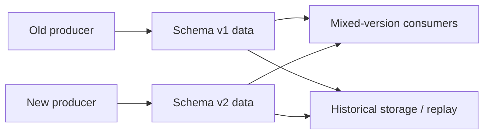

# Schema Evolution

## 1. Overview

Schema evolution is the discipline of changing data shape and data meaning over time without breaking the systems, clients, or stored history that depend on it.

That definition is intentionally broader than "changing fields."

Schema evolution is not only about syntax.

It is also about compatibility across time.

This matters because data outlives code.

A system may still encounter:

- old records in a database
- old events in a topic
- old clients using old payloads
- old backups restored during recovery
- mixed-version services during rolling deployments

That means a schema change is rarely a one-moment event.

It is a period where multiple versions coexist.

This is why schema evolution is one of the most important and most underestimated operational disciplines in distributed systems.

A field added casually can break:

- a consumer that rejects unknown data
- a migration that assumes complete backfill
- a replay pipeline processing historical events

A field removed casually can break:

- old writers
- rolling deploys
- stale mobile clients
- historical data readers

And even if the shape does not change, meaning can change:

- units change from cents to dollars
- status values mean something different
- a nullable field becomes semantically required

So schema evolution is not just about changing the contract.

It is about preserving enough compatibility that the system can survive the change while still moving forward.

## 2. The Core Problem

Very few systems upgrade everything simultaneously.

During any meaningful schema transition, the environment often contains a mixture of:

- old producers
- new producers
- old consumers
- new consumers
- historical data
- replay or restore paths

That means the system must tolerate version skew.

Consider an event stream.

The producer deploys a new field today.

Some consumers update immediately.

Others update next week.

One analytics job is rebuilt from events written last month.

A backfill job reads both new and old payloads.

This is a compatibility problem across time, not just across processes.

The same applies to databases.

If one service writes a new column and another service still reads the old shape, the rollout can break unless the change is staged.

So the real schema-evolution problem is:

How does a system change data contracts while old and new forms coexist long enough for the entire platform to transition safely?

That question is at the heart of most production-safe schema work.

## 3. Visual Model

What to notice:

- version skew is normal during change
- old and new data forms coexist in live systems and historical paths
- compatibility must be designed, not assumed

## 4. Formal Statement

Schema evolution is the process of modifying the structure or semantics of data while preserving required compatibility guarantees across producers, consumers, stored history, and deployment timelines.

A serious schema-evolution design has to define:

- backward compatibility expectations
- forward compatibility expectations
- rollout sequencing
- migration or backfill strategy
- deprecation windows
- validation and contract enforcement

The critical phrase is "required compatibility guarantees."

Not every system needs the same kind of compatibility.

But every mature system needs to know which kind it does need.

## 5. Key Terms

### 5.1 Backward Compatibility

New readers or consumers can process old data produced before the change.

### 5.2 Forward Compatibility

Old readers or consumers can tolerate data produced by newer writers.

### 5.3 Additive Change

A change that adds optional or ignorable structure without breaking older consumers that do not know about it.

This is often the safest kind of change.

### 5.4 Breaking Change

A change that can cause existing readers, writers, or processors to fail or misinterpret data.

Examples:

- removing a field
- changing field type incompatibly
- changing enum meaning

### 5.5 Migration

A migration updates stored data or database structure to support a new schema.

### 5.6 Backfill

A backfill rewrites or populates existing records to align with a new model.

### 5.7 Tolerant Reader

A tolerant reader ignores unknown fields or optional extensions rather than failing rigidly.

### 5.8 Expand-Contract

An approach where the system first expands the schema safely, then later contracts it after consumers have migrated.

## 6. Why the Constraint Exists

The constraint exists because data and code move at different speeds.

Code can be redeployed.

Data persists.

And in distributed systems, different code paths upgrade at different times.

This creates version skew everywhere:

- mobile clients update slowly
- services deploy gradually
- events remain in logs
- backups preserve old history
- reprocessing jobs revisit old formats

A team cannot simply change a schema and assume all parties now speak the new version instantly.

That is why the operational reality of schema evolution is about coexistence.

The system must often live in a mixed-version world for some period.

That mixed period is where most failures occur.

The constraint is therefore unavoidable:

schema evolution is less about the final schema and more about the transition between schemas.

## 7. Main Variants or Modes

### 7.1 Additive Evolution

The system adds optional fields or new structures without removing old ones immediately.

Strengths:

- safest rollout path
- good fit for rolling deploys and mixed-version consumers

Costs:

- schema may become temporarily larger or messier
- cleanup is delayed

### 7.2 Breaking Replacement

The system removes or redefines fields in a way incompatible with old readers or writers.

Strengths:

- cleaner end-state if done successfully

Costs:

- high rollout risk
- usually requires coordinated deployment or version negotiation

This should be used carefully.

### 7.3 Expand-Contract

The system:

1. adds the new representation
2. updates readers and writers gradually
3. migrates existing usage
4. removes the old representation later

Strengths:

- safer transitions
- works well for databases and APIs

Costs:

- longer migration period
- temporary duplication

### 7.4 Versioned Contracts

Some systems explicitly version message or API schema.

Strengths:

- makes compatibility intent clearer

Costs:

- version sprawl if overused
- version number alone does not solve semantic compatibility

### 7.5 Semantic Evolution Without Shape Change

Sometimes the field stays the same and the meaning changes.

Examples:

- `status=active` gains a narrower definition
- numeric field changes units
- default values change business interpretation

This is often more dangerous than structural change because the break is less obvious.

## 8. Supporting Mechanisms and Related Ideas

### 8.1 Schema Registries and Contract Validation

Registries and CI checks can enforce:

- allowed compatibility changes
- producer contract checks
- consumer validation

These tools are especially valuable for event-driven systems.

### 8.2 Tolerant Readers

Consumers that ignore unknown fields and rely only on what they need are often far easier to evolve safely.

### 8.3 Database Migration Strategy

Database schema changes often need staged rollout:

- add columns first
- write both old and new if needed
- switch reads
- backfill data
- remove old fields later

### 8.4 Event Replay and Historical Data

Schema evolution must consider historical data.

If old events are replayed, the consumer must still understand them or an adapter path must exist.

### 8.5 Feature Flags and Phased Rollouts

Rolling out schema changes in stages often relies on:

- feature flags
- canary deployments
- phased writer changes

### 8.6 Observability During Migration

Teams need visibility into:

- mixed-version traffic
- validation failures
- migration progress
- old-reader usage

without that, they may remove compatibility too early.

## 9. Real-World Examples

### Event Streams with Long-Lived Consumers

An analytics pipeline and several operational consumers may read the same topic over long periods.

The producer adds a new field.

This works only if:

- old consumers can ignore it
- new consumers can tolerate older events without it

This is one of the clearest schema evolution scenarios because producers and consumers upgrade independently.

### Public APIs

Public APIs must often support older clients for long periods.

Breaking fields, required parameters, or meaning casually is expensive because external clients do not upgrade on your schedule.

### Database Migrations in Live Systems

A service adds a new column and gradually shifts reads and writes to it before dropping the old column.

This is classic expand-contract evolution and is one of the safest patterns for production data changes.

### Multi-Service Shared Data Contracts

If several services depend on a shared data shape, semantic changes can be just as risky as structural changes because different teams may interpret the same field differently after rollout.

## 10. Common Misconceptions

### "Adding a Field Is Always Safe"

Wrong.

It is often safe only if:

- old consumers ignore unknown fields
- new fields are truly optional
- new semantics do not implicitly break old assumptions

### "Version Numbers Solve Compatibility"

Wrong.

Version numbers help organize change.

They do not replace:

- rollout sequencing
- semantic discipline
- reader tolerance

### "Schema Is Just Shape"

Wrong.

Meaning changes are often just as dangerous as field additions or removals.

### "Once the Deploy Is Done, the Migration Is Done"

Wrong.

Historical data, old clients, and replay paths may continue to encounter old schemas long after the deploy finished.

### "Only APIs Need Schema Evolution Discipline"

Wrong.

Databases, event streams, background jobs, and internal service contracts all need it.

## 11. Design Guidance

The right question is not:

Can we change this schema?

The right question is:

What mixed-version world will exist during and after the change, and can every participant survive it?

### Prefer

- additive changes first
- tolerant readers
- expand-contract rollouts
- explicit migration windows
- rehearsal on realistic old data

### Be Careful About

- removing fields too early
- assuming semantic changes are harmless if shape is unchanged
- ignoring replay and restore paths
- relying on synchronized deploys across many independent consumers

### Questions Worth Asking

- who still reads the old shape
- who might replay old data later
- what happens during rolling deploy
- how will backfill progress be validated
- when is it actually safe to remove the old form

### Practical Heuristic

If a change cannot survive old and new versions coexisting for a while, it is probably not production-safe yet.

## 12. Reusable Takeaways

- Schema evolution is fundamentally a compatibility-over-time problem.
- Data outlives code, so mixed-version operation is normal.
- Additive and expand-contract changes are safer than abrupt replacement.
- Semantic changes can be just as breaking as structural changes.
- Historical data and replay paths are part of the schema contract.
- Good schema evolution requires rollout discipline, not just good intentions.

## 13. Summary

Schema evolution is the practice of changing data contracts without breaking live systems, historical data, or rolling deployments.

The benefit is safe long-term change in systems where data and software evolve at different speeds.

The tradeoff is that change becomes a disciplined process:

- compatibility rules
- staged rollout
- backfill or migration planning
- delayed cleanup

That discipline is what lets distributed systems keep moving forward without treating every schema change like a leap of faith.
