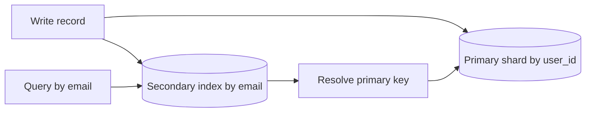

# Secondary Indexes in Distributed Systems

## 1. Overview

Secondary indexes in distributed systems are alternate lookup structures that let the system answer queries by fields other than the primary partitioning or storage key.

That sounds familiar because secondary indexes exist in single-node databases too.

The distributed version is meaningfully harder.

On one machine, an index is mostly a local performance structure.

Across many shards or partitions, a secondary index becomes a distributed systems problem involving:

- data placement
- write amplification
- consistency lag
- hotspot risk
- repair and rebuild

This matters because products rarely query only by the primary storage key.

They need queries such as:

- user by email
- order by status
- listing by category and recency
- jobs by failure state

The primary partition key is chosen for some reason, but product access patterns almost always need more than one dimension.

Secondary indexes are how systems provide those alternate paths.

When designed well, they make rich read patterns feasible at scale.

When designed poorly, they create one of the most expensive hidden tradeoffs in distributed storage:

- every write now has to maintain more than one truth surface

That is why distributed secondary indexes are not "just another index." They are a deliberate trade of write simplicity for read flexibility.

## 2. The Core Problem

Distributed data stores optimize placement by one main key or partitioning strategy.

That might be:

- user ID
- tenant ID
- order ID
- time bucket
- shard key

That choice helps:

- routing
- locality
- scaling
- ownership

But products rarely want to read only by that one key.

A user service partitioned by user ID still needs:

- login by email
- lookup by phone number

A marketplace sharded by listing ID still needs:

- listings by category
- listings by seller
- listings by status and recency

If the system cannot query by those alternate dimensions efficiently, it either:

- scans too broadly
- or precomputes and maintains another access path

That alternate access path is the secondary index.

The real problem is:

How can the system support alternate query dimensions across partitioned data without making every write path too slow, too inconsistent, or too operationally fragile?

That is the distributed indexing problem.

## 3. Visual Model

What to notice:

- one logical write now affects both the primary record and the index path
- the index may live on different shards than the base record
- alternate read flexibility is purchased with extra distributed maintenance work

## 4. Formal Statement

A secondary index in a distributed system is an additional data structure that maps one or more non-primary-key attributes to primary records, shards, or locations so the system can answer alternate query patterns without full scans.

A serious distributed secondary index design has to define:

- how the index is partitioned
- how updates reach the index
- whether updates are synchronous or asynchronous
- what consistency guarantees queries should expect
- how the index is repaired, rebuilt, and rebalanced

The design point is critical:

the more alternate query paths the system wants, the more it must pay in write-path work and maintenance complexity.

## 5. Key Terms

### 5.1 Primary Key

The primary key is the main key used for canonical record identity and often for data placement.

### 5.2 Partition Key

The partition key determines which shard or partition stores the base record.

This is not always the same as the application's conceptual primary key, but it often is closely related.

### 5.3 Secondary Key

A field or combination of fields used for alternate lookup.

Examples:

- email
- status
- timestamp
- category plus created time

### 5.4 Local Secondary Index

A local secondary index exists within the same partition boundary as the base data.

It is simpler, but its query scope is limited by that partition design.

### 5.5 Global Secondary Index

A global secondary index spans the broader dataset and can support cross-partition queries.

This is much more powerful and much more expensive.

### 5.6 Write Amplification

Write amplification is the extra work caused by maintaining multiple structures per logical write.

### 5.7 Index Consistency

Index consistency is the degree to which the secondary index reflects the current primary data immediately or with some lag.

### 5.8 Rebuild

A rebuild is the process of reconstructing the index from source-of-truth data or logs.

## 6. Why the Constraint Exists

Distributed systems can optimize locality only along a limited number of dimensions.

A dataset partitioned by `user_id` cannot also magically be partitioned by `email`, `status`, and `created_at` at the same time without maintaining more structures.

That means the system faces a real choice:

- optimize one access path natively
- or maintain alternate access paths through indexes

The reason this becomes a distributed systems issue is that the index may not live with the base record.

Suppose the base record is on shard A and the email index entry belongs on shard B.

A write to one user record may now require:

- primary data update
- index update somewhere else

That creates new questions:

- what if the primary update succeeds and the index update is delayed
- what if the index becomes stale
- what if one secondary key is extremely hot
- how do you rebuild the index after corruption or code bugs

The constraint exists because alternate query flexibility requires extra maintained state, and maintained state across partitions always introduces coordination, lag, or both.

## 7. Main Variants or Modes

### 7.1 Local Secondary Indexes

These exist within one partition or shard boundary.

Strengths:

- simpler maintenance
- better locality
- lower cross-shard coordination cost

Costs:

- cannot answer truly global alternate-key queries unless the primary partition scope already matches the query scope

This is useful when queries remain scoped to one tenant or partition anyway.

### 7.2 Global Secondary Indexes

These span the broader dataset and support alternate-key lookups across shards.

Strengths:

- much richer query flexibility
- practical support for global alternate-key access

Costs:

- cross-shard updates
- hotspots
- more difficult rebuilds
- more difficult consistency guarantees

This is where distributed indexing becomes operationally expensive.

### 7.3 Synchronous Index Maintenance

The index is updated as part of the write path before success is confirmed.

Strengths:

- stronger consistency between primary data and index
- fewer stale-read surprises

Costs:

- slower writes
- more failure sensitivity
- higher coordination cost

### 7.4 Asynchronous Index Maintenance

The primary write commits first and the index catches up later.

Strengths:

- faster writes
- less coupling in the critical path

Costs:

- stale index reads
- missing index entries briefly
- repair complexity

This is often acceptable only when the query path tolerates lag.

### 7.5 Composite Secondary Indexes

Indexes over several fields such as `(status, created_at)` or `(tenant_id, email)`.

Strengths:

- more targeted query support
- efficient ordering within the intended query shape

Costs:

- more index cardinality and maintenance complexity
- easier to misuse if query patterns shift

### 7.6 Derived Search Indexes

Sometimes an external search or analytical index effectively acts as a distributed secondary index:

- Elasticsearch
- OpenSearch
- Solr-like search models

Strengths:

- rich query capability

Costs:

- eventual consistency
- another datastore to operate

## 8. Supporting Mechanisms and Related Ideas

### 8.1 Partitioning Strategy

The cost of a secondary index depends heavily on how the base data is partitioned.

Good partitioning can reduce cross-shard index pain for some queries. Bad partitioning can make every useful alternate query expensive.

### 8.2 Schema Evolution

Changing indexed fields, key formats, or query semantics is often a schema and migration problem as much as an indexing problem.

### 8.3 Rebuild and Backfill

A production-grade index design should have a credible answer for:

- how the index is rebuilt
- how old records are backfilled
- how correctness is validated after rebuild

### 8.4 Query Planners and Routing

The application or datastore must know:

- when to use the index
- how to follow the index back to base records
- whether covering reads are possible from the index alone

### 8.5 Hotspot Management

An alternate key such as:

- `status = active`
- `country = US`

can create extremely hot partitions if the distribution is skewed.

Distributed secondary indexes must consider not just correctness but key popularity distribution.

### 8.6 Repair and Divergence Detection

If the primary data and the index diverge, the system needs a repair model.

Without repair tooling, eventual consistency bugs tend to become long-lived correctness bugs.

## 9. Real-World Examples

### User Login by Email

A user system may partition base records by user ID for balanced distribution, but login still needs fast lookup by email.

That is a classic global secondary index problem because the product needs alternate-key lookup that does not align with base placement.

### Marketplace Filters

Listings may be stored by listing ID or seller ID, but user-facing browse experiences need:

- category
- status
- created time
- location

Supporting these queries often requires one or more secondary indexes or search-oriented derived indexes.

### Job Status Dashboards

A job execution system may store jobs by job ID but operations wants queries like:

- failed jobs in last hour
- pending jobs by tenant
- retries by status

This is a strong example of secondary indexing as product and operational necessity rather than optional optimization.

### Multi-Tenant Admin Search

A system may need:

- tenant-scoped email lookup
- account by external ID
- subscription by status

These are all alternate access paths that the primary storage key alone rarely solves.

## 10. Common Misconceptions

### "An Index Is Just a Faster Lookup"

In distributed systems, an index is also:

- extra state
- extra writes
- extra consistency semantics
- extra repair responsibility

### "Secondary Indexes Scale Like Primary Keys"

Usually not.

Primary keys often align with placement strategy.

Secondary keys often cut across it.

### "Asynchronous Index Maintenance Is Always Fine"

Only if the query path truly tolerates stale or temporarily missing results.

### "Just Add an Index for Every Query"

That is a fast way to turn the write path into a maintenance burden.

### "Search Engines and Secondary Indexes Are Completely Different"

Often they play similar architectural roles: alternate query paths derived from source-of-truth data.

## 11. Design Guidance

The best design question is:

Which alternate queries matter enough to justify permanent extra write-path and maintenance cost?

### Strong Fits

- high-value lookup paths like email, external ID, order status
- operationally critical filtered views
- product experiences that are central to user behavior

### Weak Fits

- rare ad hoc queries
- poorly understood future access patterns
- alternate paths with extreme cardinality skew and low value

### Prefer

- designing indexes around actual product query patterns
- explicit freshness expectations
- rebuild and repair plans before launch
- awareness of key skew and hotspot risk

### Questions Worth Asking

- how often is this query used
- can it tolerate lag
- what extra writes does it impose
- how will the index be repaired if it drifts
- is this really an index problem or a search/analytics projection problem

### Practical Heuristic

If the query is core to the product and happens often, a distributed secondary index may be worth its cost.

If the query is infrequent or operationally optional, a slower path or derived offline view may be better.

## 12. Reusable Takeaways

- Secondary indexes in distributed systems buy alternate read paths with extra write-path complexity.
- Global indexes are much more powerful and much more expensive than local ones.
- Freshness, hotspot risk, and rebuildability matter as much as lookup speed.
- Every index is a long-term operational commitment, not just a schema tweak.
- The best distributed indexes are tied to real, high-value query patterns.

## 13. Summary

Secondary indexes in distributed systems let the system answer important queries by keys other than the primary storage key.

The benefit is richer product access patterns and far fewer full scans.

The tradeoff is substantial:

- extra state
- extra writes
- extra consistency work
- extra repair responsibility

That is why good distributed indexing is less about adding another lookup structure and more about being disciplined about which alternate query paths truly deserve one.
