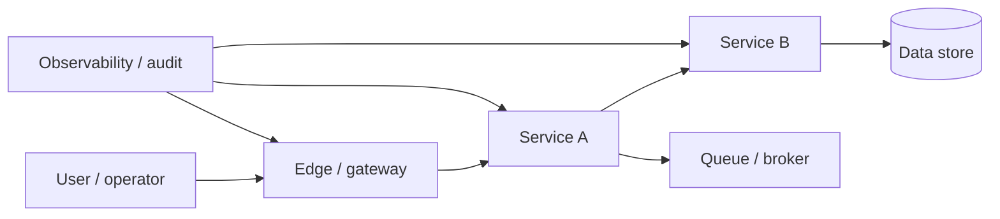

# Security Basics for Distributed Systems

## 1. Overview

Security in distributed systems is the discipline of protecting identity, communication, data, control paths, and operational trust across many independently deployed components.

That sounds broad because it is broad.

In a small monolith, security discussions often center around:

- user login
- database protection
- TLS at the edge
- some administrative access controls

In a distributed system, the trust surface multiplies quickly:

- service-to-service calls cross networks
- credentials exist in many places
- infrastructure and application layers both participate in access decisions
- one compromised component may attempt lateral movement into others
- configuration errors can expose internal APIs unexpectedly

This changes the nature of the security problem.

Security is no longer just about protecting the perimeter.

It becomes a question of how trust moves through the system:

- how identities are established
- how permissions are scoped
- how secrets are stored and rotated
- how traffic is authenticated between services
- how privileged actions are audited
- how the platform limits blast radius when something goes wrong

That is why "security basics" in distributed systems is not a small topic.

It is foundational architecture.

When security is treated as an afterthought, distributed systems tend to drift into one of two bad states:

- accidental implicit trust, where internal calls are treated as safe by default
- fragmented controls, where every team implements something different and the overall posture becomes inconsistent

Good distributed-system security does not eliminate risk. It makes trust explicit and limits the damage of mistakes, compromise, and misuse.

## 2. The Core Problem

A distributed system is made of many boundaries.

Examples:

- internet to edge
- edge to service
- service to service
- service to database
- service to queue
- human operator to control plane

Every one of those boundaries can become a security decision point.

That matters because trust does not automatically survive crossing a boundary.

A request that is trusted at the gateway should not automatically be trusted forever by every downstream service unless the system has explicitly designed that trust propagation.

Likewise, a service inside a private network should not automatically have permission to call every other service or read every datastore.

Without deliberate design, systems often fall into one of these patterns:

- internal network equals trusted network
- one shared credential is reused too broadly
- long-lived secrets are copied into many services
- authorization happens only at the edge
- service identities are weak or non-existent
- auditability exists for user actions but not for machine actions

The real problem security solves in distributed systems is not only "keep attackers out."

It is also:

How does the system make trust, identity, and privilege explicit enough that compromise, misconfiguration, or abuse does not turn one mistake into full-system access?

That is a much more useful framing for architecture work.

## 3. Visual Model

What to notice:

- every hop is a trust boundary, not just the public edge
- identity and authorization have to remain meaningful after the request enters the system
- audit and observability are part of security because trust without visibility is brittle

## 4. Formal Statement

Security in distributed systems is the set of architectural, operational, and cryptographic controls used to establish trust, protect communication, limit privilege, and preserve system integrity across multiple independently deployed components and trust boundaries.

A serious distributed-system security model has to define:

- how users and services authenticate
- how permissions are granted and enforced
- how secrets and keys are issued, rotated, and revoked
- how communication is protected in transit
- how sensitive data is protected at rest
- how privileged actions are audited
- how abuse and anomalous behavior are detected
- how blast radius is limited when one component is compromised

This definition matters because it pushes security out of the "login plus firewall" mindset.

A secure distributed system is not one that has one strong edge.

It is one that has coherent trust semantics throughout the system.

## 5. Key Terms

### 5.1 Trust Boundary

A trust boundary is any point where the system must stop assuming safety and re-evaluate identity, integrity, or permission.

Examples:

- inbound internet traffic
- service-to-service call
- control plane action
- access to a high-value data store

### 5.2 Authentication

Authentication answers:

Who is making this request?

In distributed systems, that can apply to:

- end users
- background jobs
- services
- operators

### 5.3 Authorization

Authorization answers:

What is this authenticated actor allowed to do here?

It is distinct from authentication and often much more context-dependent.

### 5.4 Secret Management

Secret management is the storage, distribution, rotation, and revocation of credentials such as:

- API keys
- database passwords
- signing keys
- tokens
- certificates

### 5.5 Encryption in Transit

Encryption in transit protects data as it moves across the network.

In distributed systems, this matters not only at the public edge but often between internal services as well.

### 5.6 Encryption at Rest

Encryption at rest protects stored data from certain classes of media or storage exposure.

It is useful, but it does not replace authorization and access control.

### 5.7 Least Privilege

Least privilege means each actor should have only the permissions it needs, not broad access "just in case."

### 5.8 Blast Radius

Blast radius is the scope of damage possible if a credential, service, host, or operator account is compromised.

Security architecture should be evaluated partly by how small this radius stays under failure or compromise.

## 6. Why the Constraint Exists

Distributed systems are fundamentally more exposed to trust fragmentation than monoliths.

There are several reasons.

First, traffic crosses the network more often.

That means more opportunities for:

- interception
- spoofing
- accidental exposure
- replay

Second, identity is no longer just a human concern.

Now services themselves need identities, and those identities often make consequential decisions:

- reading data
- publishing messages
- triggering workflows
- calling control planes

Third, secrets become operational artifacts.

They must be:

- injected
- refreshed
- rotated
- invalidated
- monitored

Fourth, internal compromise matters much more than teams often assume.

Suppose one service is exploited through an application bug.

If the internal environment assumes "inside equals trusted," the attacker may be able to:

- read broad internal APIs
- reach databases directly
- pivot laterally to other services
- access operational interfaces

This is why private network alone is not a security model.

The constraint exists because distributed systems spread both capability and trust. Once capability is spread out, trust must be designed with equal discipline or the system becomes insecure by default.

## 7. Main Variants or Modes

### 7.1 Perimeter-Centric Security

This model assumes the outer boundary is strongly protected and the interior is relatively trusted.

Strengths:

- simpler to reason about initially
- lower implementation overhead in small systems

Costs:

- weak internal trust model
- poor resilience against lateral movement
- brittle once the system grows or integrates with many services

This model often appears accidentally rather than deliberately.

### 7.2 Zero-Trust-Oriented Internal Design

In this model, services authenticate each other explicitly and internal calls are not trusted solely because they are on the private network.

Strengths:

- stronger internal boundaries
- better least-privilege enforcement
- better posture under partial compromise

Costs:

- more certificate or token management
- more infrastructure complexity
- more operational discipline required

This does not mean every call is treated as hostile in the same way. It means trust must be explicit rather than inherited implicitly from network position.

### 7.3 Defense in Depth

This is not one mechanism. It is the practice of applying multiple layers of control so one failure does not become catastrophic.

Examples:

- gateway auth plus service auth
- mTLS plus scoped service identities
- network policy plus authorization checks
- encryption plus audit logging

Strengths:

- reduced single-point security failure

Costs:

- more configuration surface
- more complexity to keep controls aligned

### 7.4 Centralized Identity with Distributed Enforcement

Many systems use a centralized identity provider but enforce authorization across multiple services.

Strengths:

- unified identity lifecycle
- consistent credential issuance

Costs:

- enforcement correctness still depends on individual services and shared libraries

### 7.5 Fine-Grained vs Coarse-Grained Authorization

Some systems authorize only at route level.

Others authorize at resource or action level.

Coarse authorization is cheaper and simpler.

Fine-grained authorization is often necessary when:

- tenants share infrastructure
- sensitive resources exist
- service-to-service permissions are narrowly scoped

## 8. Supporting Mechanisms and Related Ideas

### 8.1 Service Identity

If services do not have meaningful identities, internal security becomes mostly network-based and weak.

Service identity can be carried through:

- mTLS certificates
- workload identity
- signed tokens

This is one of the biggest maturity shifts in distributed platforms.

### 8.2 Secret Rotation

Long-lived shared secrets are one of the most common structural weaknesses in real systems.

Rotation matters because:

- secrets leak
- people leave
- environments get copied
- repositories are sometimes mishandled

Short-lived credentials and automated rotation reduce the damage window.

### 8.3 Network Policy

Network controls are still useful.

They should not be confused with full authorization, but they can reduce exposure by limiting which components can even attempt to talk to one another.

### 8.4 Audit Logging

Security without auditability is hard to operate.

You need to know:

- who changed a privilege
- which service called a sensitive API
- when an admin action occurred
- what token or principal was involved

### 8.5 Abuse Protection

Security is not only about valid identities.

It is also about protecting the system from:

- scraping
- brute force attacks
- resource exhaustion
- malicious automation

This is where rate limiting, WAF rules, anomaly detection, and quota systems often overlap with security.

### 8.6 Incident Response and Recovery

A distributed security design should support containment.

Questions worth asking:

- can a compromised credential be revoked quickly
- can one tenant's abuse be isolated
- can one service's identity be disabled without shutting down the platform

These are architecture questions, not only operational questions.

## 9. Real-World Examples

### Internal Microservice Platforms

A service mesh or internal platform may issue service identities and enforce mTLS so each service call is authenticated.

This makes sense because:

- internal traffic is still sensitive
- lateral movement risk is real
- service-level audit and authorization become feasible

The tradeoff is added certificate lifecycle and platform complexity.

### Public API Platforms

Public APIs often need layered controls:

- user or client authentication
- route authorization
- quotas
- abuse protection
- auditability for admin or partner operations

A single authentication layer is not enough because the problem is broader than identity proof.

### Control Planes and Admin Systems

Administrative systems are often the highest-value targets in the environment.

They may need:

- MFA
- stronger session policy
- narrower authorization scopes
- elevated audit logging
- explicit approval or break-glass procedures

This is a good example of why not every surface should have the same security posture.

### Multi-Tenant SaaS

Multi-tenant systems must enforce:

- tenant isolation
- role-based access
- service scoping
- secure internal propagation of tenant context

The challenge is not only authenticating the user. It is ensuring every downstream service continues enforcing the correct tenant boundary.

## 10. Common Misconceptions

### "Private Network Means Trusted Network"

Wrong.

Private networks reduce some exposure. They do not eliminate:

- compromised hosts
- leaked credentials
- misrouted traffic
- internal abuse

### "Authentication Solves Security"

Wrong.

Authentication only proves identity.

Security also requires:

- authorization
- secret management
- observability
- blast-radius control
- abuse protection

### "Security Is the Gateway Team's Problem"

Wrong.

Gateways help at the edge, but service-to-service calls, background workers, data stores, and admin systems still need trustworthy security boundaries.

### "Encryption at Rest Means the Data Is Safe"

Only partially.

Encryption at rest helps in some storage-compromise scenarios, but it does not prevent an over-privileged service or user from reading data legitimately through the system.

### "Least Privilege Is Too Expensive"

Broad permissions often seem cheaper initially and much more expensive during incidents.

Least privilege is not free, but it is one of the strongest tools for reducing blast radius.

## 11. Design Guidance

The best security guidance for distributed systems is to ask:

Where does trust enter, where does it propagate, and where should it stop?

### Prefer

- explicit service identities
- least-privilege access models
- short-lived credentials where possible
- defense in depth instead of one hard perimeter
- auditable privileged actions
- revocation and rotation paths that are actually tested

### Be Careful About

- shared long-lived secrets across many services
- assuming edge authentication eliminates downstream authorization needs
- treating internal systems as lower-risk by default
- inconsistent auth logic copied across teams
- operational interfaces with weaker controls than data-plane APIs

### Questions Worth Asking

- if this service is compromised, what else can it reach
- how does a downstream service know who the original caller was
- how are admin actions separated from ordinary product actions
- can a leaked token be revoked quickly
- what evidence exists after a privileged action was taken

### A Useful Heuristic

If one credential or one service account can unlock too many unrelated parts of the system, the design probably has too much implicit trust.

## 12. Reusable Takeaways

- Distributed systems multiply trust boundaries, so security must be architectural rather than peripheral.
- Internal traffic still needs explicit identity and permission models.
- Authentication, authorization, and secret management are distinct concerns and all matter.
- Least privilege and blast-radius reduction are some of the most practical security design tools.
- Auditability is part of security because trust without visibility is hard to operate.
- Private networking helps, but it is not a substitute for explicit trust controls.
- Good security design assumes compromise is possible and limits how far it can spread.

## 13. Summary

Security in distributed systems is the practice of making trust explicit across many services, networks, identities, and operational paths.

The benefit is not perfect safety. The benefit is controlled trust, narrower blast radius, and better survivability when something goes wrong.

The cost is more discipline:

- stronger identity models
- tighter access control
- better secret handling
- better auditability

That discipline is what turns a distributed system from a loose collection of network-reachable components into a platform that can be operated safely at scale.
