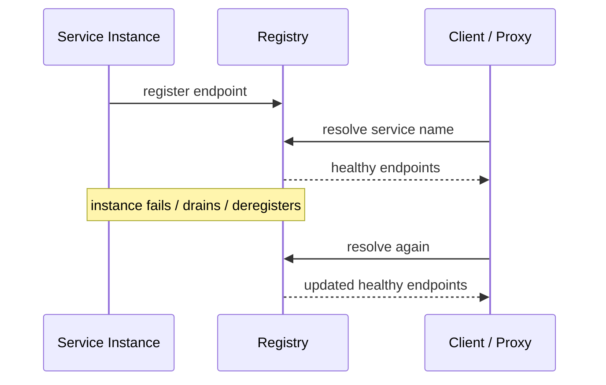

# Service Discovery

## 1. Overview

Service discovery is the mechanism by which a client finds the current reachable instances of a logical service.

In static systems, this sounds unnecessary.

If a service always lived at one hostname forever, a config file would be enough.

Modern distributed systems do not behave that way.

Instances:

- autoscale
- restart
- move across zones
- roll during deploys
- fail and disappear

What remains stable is often not the instance.

What remains stable is the service identity:

- `payments-service`
- `inventory-service`
- `user-profile-service`

Service discovery exists to map that stable identity to the current healthy endpoints that can actually serve traffic.

When designed well, service discovery lets the system remain dynamic without forcing clients to know infrastructure details.

When designed poorly, it creates stale routing, unhealthy endpoint selection, and dependency on registry behavior that nobody fully understands.

That is why service discovery is more than a lookup table.

It is a dynamic membership, health, and routing coordination problem.

## 2. The Core Problem

A distributed service rarely stays at the same network location forever.

If clients hardcode endpoints:

- new instances receive no traffic
- failed instances remain targeted
- deploys become brittle
- autoscaling does not work cleanly

If a central registry exists but health is wrong:

- clients may still hit dead instances

If registration is delayed:

- new instances may be alive but unused

So the real problem is:

How does the system let clients target a stable logical service name while the actual serving instances change continuously underneath?

That means service discovery must solve several subproblems:

- registration
- liveness
- removal
- lookup freshness
- routing policy

## 3. Visual Model

What to notice:

- service discovery is a continuously changing map, not a one-time resolution
- health and membership updates are part of discovery correctness
- clients or proxies depend on the freshness of that map

## 4. Formal Statement

Service discovery is the system by which stable service identities are mapped to currently valid and healthy network endpoints in a dynamic distributed environment.

A serious discovery design has to define:

- how instances register
- how health is determined
- how dead or draining instances are removed
- how clients learn updates
- whether routing happens client-side or server-side

The key design point is that service discovery is not only naming.

It is naming plus current membership plus reachability confidence.

## 5. Key Terms

### 5.1 Service Identity

A stable logical name for a service independent of any specific machine or instance.

### 5.2 Endpoint

The concrete address and port that can receive traffic for a specific instance.

### 5.3 Service Registry

A system that stores the current mapping of service identities to endpoints.

### 5.4 Registration

The process by which an instance announces itself as available.

### 5.5 Deregistration

The removal of an instance from discoverable membership.

### 5.6 Health Check

A mechanism used to determine whether an instance should still be considered eligible for traffic.

### 5.7 Client-Side Discovery

The client resolves service endpoints and often chooses the backend itself.

### 5.8 Server-Side Discovery

A proxy, load balancer, or platform layer performs discovery and routes on the client's behalf.

## 6. Why the Constraint Exists

Distributed systems want elastic infrastructure and stable service semantics at the same time.

Elastic infrastructure means:

- instances come and go
- topology changes
- rolling deploys replace endpoints

Stable service semantics mean clients want to think:

- call `payments-service`

not:

- call `10.3.8.21` unless deployment just changed

The constraint exists because those two desires are in tension.

If endpoint knowledge lives in every client statically, the system becomes brittle.

If discovery exists but changes propagate slowly or incorrectly, the system becomes unstable in a different way.

So service discovery is fundamentally about maintaining a current-enough mapping between logical name and usable reality.

## 7. Main Variants or Modes

### 7.1 Client-Side Discovery

Clients query the registry and choose the backend instance themselves.

Strengths:

- no extra proxy hop
- flexible client-side policy

Costs:

- every client needs discovery logic
- stale caches can hurt routing quality
- client libraries become more complex

### 7.2 Server-Side Discovery

A load balancer, sidecar, or proxy resolves endpoints and routes traffic.

Strengths:

- simpler clients
- centralized routing policy
- easier policy enforcement

Costs:

- more infrastructure
- central path becomes important operationally

### 7.3 DNS-Based Discovery

Service discovery may be exposed through DNS records.

Strengths:

- familiar interface
- easy integration for many clients

Costs:

- DNS caching can make freshness weaker
- less expressive than richer registry systems

### 7.4 Registry with Active Health Management

The registry or platform actively updates membership based on readiness or health.

Strengths:

- better traffic quality

Costs:

- health correctness becomes critical

### 7.5 Mesh or Sidecar-Based Discovery

A service mesh often hides discovery and routing behind sidecars or data-plane proxies.

Strengths:

- consistent traffic behavior
- less logic inside application code

Costs:

- more platform complexity
- debugging can become less transparent

## 8. Supporting Mechanisms and Related Ideas

### 8.1 Load Balancing

Discovery tells the system which endpoints exist.

Load balancing decides how traffic is spread across them.

### 8.2 Health Checks

If the health model is wrong, discovery will expose endpoints that should not receive traffic.

### 8.3 Autoscaling

Discovery must absorb:

- instance birth
- instance death
- rolling replacement

without requiring manual configuration changes.

### 8.4 Deployment and Draining

Instances often need graceful removal from discovery before shutdown so in-flight traffic is not dropped abruptly.

### 8.5 Service Meshes and Proxies

Modern platforms often combine discovery, routing, retries, and policy into one traffic layer.

This is powerful and can make root-cause reasoning harder if the team treats it as opaque magic.

## 9. Real-World Examples

### Autoscaled Service Fleets

In cloud environments, service instances are created and removed continuously.

Discovery makes the fleet usable because callers can resolve the currently healthy endpoints dynamically instead of depending on stale manual host lists.

### Kubernetes Services

Kubernetes gives workloads a stable service identity while pods churn beneath it.

That is service discovery in practice:

- stable logical name
- changing backing instances
- health-aware routing

### Internal Multi-Service Platforms

As the number of services grows, manually managing endpoint configuration becomes brittle.

Discovery lets teams reason in terms of service identity rather than machine identity, which is far more scalable organizationally and operationally.

### Platform APIs Behind Proxies

Some organizations centralize discovery behind internal proxies or meshes so application code stays simpler and shared routing policy remains consistent.

## 10. Common Misconceptions

### "Service Discovery Is Just DNS"

Sometimes DNS is the interface.

Discovery usually needs stronger freshness, health, and membership semantics than plain DNS alone provides.

### "If Registration Exists, Discovery Is Solved"

Wrong.

Registration without correct health and timely deregistration still routes traffic poorly.

### "Only Microservices Need Service Discovery"

Any dynamic multi-instance system benefits from it, regardless of architectural branding.

### "Client-Side Discovery Is Always Better Because It Removes a Hop"

It removes a central hop and pushes routing complexity into every client.

That is a trade, not a free win.

### "Healthy Means Reachable"

Not always.

A process can be reachable and still:

- overloaded
- not ready
- unable to serve real requests safely

## 11. Design Guidance

The best design question is:

Who should own the moving map from service identity to healthy endpoints: each client, or a shared routing layer?

### Prefer

- stable service identities
- fast enough membership updates
- clear readiness and draining behavior
- good visibility into endpoint health and routing state

### Be Careful About

- stale caches in clients
- health checks that prove too little
- using DNS TTLs that do not match traffic dynamics
- hiding too much discovery behavior inside opaque platform layers

### Questions Worth Asking

- how quickly must failed instances disappear from routing
- what qualifies an instance as ready, not merely alive
- should clients do balancing or should proxies do it
- how are scale-up and deploy events propagated

### Practical Heuristic

If every client must understand complex membership changes and retries, server-side discovery or mesh-like routing may be worth it.

If the routing policy is simple and client libraries are controlled, client-side discovery may remain a clean design.

## 12. Reusable Takeaways

- Service discovery maps stable service identity to dynamic healthy endpoints.
- Registration, health, and deregistration are all essential parts of discovery correctness.
- Discovery and load balancing are related but distinct concerns.
- Client-side and server-side discovery trade client simplicity against shared routing complexity.
- Dynamic systems need discovery because endpoint identity changes faster than service identity.

## 13. Summary

Service discovery is how distributed systems keep service identity stable while allowing underlying instances to change continuously.

The benefit is elasticity, healthier routing, and simpler service naming.

The tradeoff is that the system must now maintain an accurate, timely view of membership and health.

That is why service discovery is not just a registry. It is a dynamic coordination layer for how services remain reachable in a changing system.
