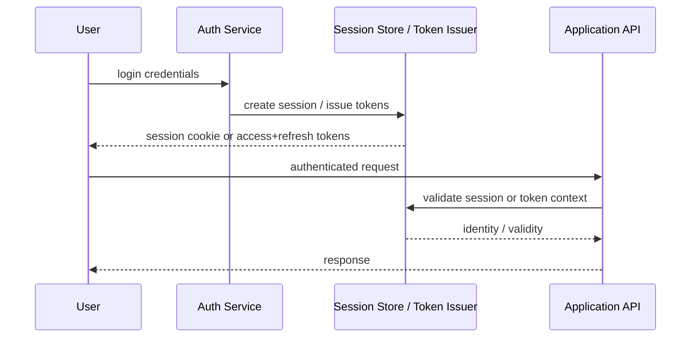

# Session Management

## 1. Overview

Session management is the set of mechanisms that maintain authenticated continuity between a user and a system across multiple requests.

The moment a user logs in, the system has a new problem:

How should future requests prove that they belong to the same authenticated interaction without forcing the user to re-enter credentials each time?

That sounds like a convenience feature. It is actually a deep security and architecture topic.

Session design affects:

- login durability
- logout behavior
- revocation speed
- horizontal scaling
- browser behavior
- mobile device behavior
- token leakage risk
- operator support and auditability

Many teams reduce the conversation to:

- server sessions vs JWT

That comparison is too shallow.

Session management is really about long-lived trust continuity. The design must decide:

- where that trust state lives
- how it is validated
- when it expires
- how it is renewed
- how it is revoked
- how it behaves when credentials, devices, or permissions change

Done well, session management gives users a smooth experience while keeping trust bounded and revocable.

Done poorly, it creates one of the most common classes of production security issues:

- stolen long-lived tokens
- weak revocation
- over-trusted browser storage
- inconsistent logout semantics
- stale privileges surviving far too long

## 2. The Core Problem

HTTP is stateless.

Authenticated applications are not.

After login, the system needs some durable way to connect future requests to an authenticated identity and associated context.

The naive options are both bad:

- ask for credentials on every request
- trust the client indefinitely with no expiry or revocation model

So the real problem is:

How does the system preserve authentication continuity across time, devices, and infrastructure without giving up control over expiry, revocation, and security posture?

This becomes more complex because requests may cross:

- many API servers
- mobile and browser clients
- gateways
- multiple backend services

Different environments impose different constraints.

Browsers care about:

- cookies
- CSRF
- same-site policy

Mobile apps care about:

- durable storage
- app restarts
- token refresh

Admin systems care about:

- shorter session windows
- stronger re-auth requirements
- tighter auditability

So session management is not one generic mechanism. It is an architecture decision that must fit the client model and the risk model.

## 3. Visual Model

What to notice:

- session continuity is established once and then validated repeatedly
- the system must decide whether validation is stateful, stateless, or hybrid
- issuance, validation, expiry, and revocation are all part of the design, not just login

## 4. Formal Statement

Session management is the set of protocols and storage mechanisms by which a system establishes, represents, validates, refreshes, expires, and revokes authenticated user continuity across multiple requests.

A real session design has to define:

- session representation
- storage location
- validation path
- idle and absolute expiry
- renewal behavior
- logout semantics
- credential change behavior
- device or browser binding strategy where relevant

The architectural point is this:

Authentication is the act of proving identity once.

Session management is how that proof remains usable and controllable over time.

## 5. Key Terms

### 5.1 Session Identifier

A session identifier is the handle that links a request to authenticated continuity.

It may be:

- opaque and server-managed
- embedded in a signed token

### 5.2 Stateful Session

The canonical session state lives on the server side, often in:

- memory-backed cache
- Redis
- database

The client usually carries only a session handle.

### 5.3 Stateless Token Session

The client carries signed state, often in an access token, and servers validate it cryptographically without looking up full session state each time.

### 5.4 Refresh Token or Refresh Session

A longer-lived mechanism used to obtain new short-lived access tokens without asking the user to log in again immediately.

### 5.5 Idle Timeout

The session expires after a period of inactivity.

### 5.6 Absolute Timeout

The session expires after a fixed maximum lifetime even if the user remains active.

### 5.7 Revocation

The system invalidates a session before its natural expiry.

### 5.8 Re-Authentication

The system asks the user to prove identity again before especially sensitive actions or after risk events.

## 6. Why the Constraint Exists

Long-lived trust is inherently risky.

Once a user has authenticated, every later request that relies on that session is effectively saying:

We still trust that this interaction represents the same authorized user.

That trust can become wrong for many reasons:

- token stolen
- browser compromised
- device lost
- user removed from tenant
- role changed
- password reset
- admin account suspended

The longer and less controllable the session, the greater the risk window.

But if sessions are too short or too strict, user experience collapses:

- frequent logouts
- repeated MFA prompts
- broken mobile continuity
- support burden

So the system has to balance:

- user continuity
- revocation speed
- validation cost
- operational simplicity

That balance is exactly why session management is not trivial.

## 7. Main Variants or Modes

### 7.1 Server-Side Sessions

The client stores an opaque session ID, often in a secure cookie.

The server stores canonical state such as:

- user ID
- issue time
- expiry
- device metadata
- revocation status

Strengths:

- strong central control
- straightforward revocation
- easy permission updates to reflect immediately

Costs:

- shared backing store required across instances
- session lookup cost on each request
- operational dependence on session infrastructure

This model remains very strong for browser-based products and sensitive applications.

### 7.2 Signed Access Tokens

The client carries signed claims and the server validates them cryptographically.

Strengths:

- low per-request lookup cost
- easy horizontal scaling
- works well for distributed API validation

Costs:

- revocation is harder
- permission freshness is harder
- token leakage is more dangerous if token lifetime is long

This is where many simplistic "JWT solves sessions" narratives break down.

### 7.3 Hybrid Access and Refresh Model

Short-lived access tokens are paired with longer-lived refresh state.

Strengths:

- access tokens remain short-lived
- user continuity is preserved without frequent login
- revocation can be attached to refresh session state

Costs:

- more moving parts
- more rotation logic
- more edge cases during token renewal

This is one of the most common practical patterns in modern systems because it balances scale with control.

### 7.4 Browser-Centric Cookie Sessions

Cookies remain one of the strongest browser-native session mechanisms when used correctly.

Strengths:

- natural browser support
- easy transport with same-site and secure settings
- good fit for web apps

Costs:

- CSRF concerns
- domain and subdomain policy complexity
- careful cookie attribute design required

### 7.5 High-Assurance Sessions

Admin tools or regulated systems may impose:

- short idle windows
- device checks
- MFA re-prompt
- step-up auth for sensitive actions

This is a reminder that not all sessions should behave the same way.

## 8. Supporting Mechanisms and Related Ideas

### 8.1 Cookies and Browser Security

Browser sessions must consider:

- `HttpOnly`
- `Secure`
- `SameSite`
- CSRF protections

Session design in browsers is inseparable from those mechanics.

### 8.2 Token Rotation

Refresh tokens or refresh sessions often need rotation so that:

- theft is easier to detect
- replay is reduced
- session continuity remains under control

### 8.3 Revocation Triggers

Good systems revoke or constrain sessions after events such as:

- password reset
- MFA reset
- account disablement
- tenant removal
- admin role removal

### 8.4 Session Auditability

Mature systems often track:

- active sessions
- device or browser metadata
- issue time
- last activity
- revocation events

This is valuable for both security and user support.

### 8.5 Authorization Freshness

If a session carries permission claims, the system must decide how fast permission changes need to take effect.

This is a common hidden design issue.

## 9. Real-World Examples

### Consumer Web Applications

A browser-based app may use secure, server-managed session cookies.

This works well because:

- browsers handle cookies naturally
- revocation is straightforward
- the server can centrally enforce expiry and permission changes

The tradeoff is shared session infrastructure and careful CSRF handling.

### Mobile Applications

Mobile apps often use:

- short-lived access tokens
- longer-lived refresh tokens

This makes sense because mobile sessions need to survive app restarts and intermittent connectivity.

The risk is that refresh tokens become highly valuable credentials and need secure device storage and rotation discipline.

### Admin Consoles

Administrative systems often enforce:

- shorter session TTLs
- stronger idle expiry
- MFA re-check for dangerous actions
- better session visibility

This is because the cost of a stolen or stale admin session is much higher than for many ordinary user flows.

### Multi-Device Consumer Accounts

A product may let a user remain logged in on several devices.

Now session management must answer:

- how to list active sessions
- how to revoke one device
- whether a password reset invalidates all devices

These are product and security questions at the same time.

## 10. Common Misconceptions

### "JWT Means Session Management Is Solved"

Wrong.

A token format does not solve:

- revocation
- expiry policy
- permission freshness
- logout semantics
- rotation

### "Server Sessions Do Not Scale"

Wrong.

They scale well in many real systems with shared backing stores and disciplined lifecycle management.

### "Logout Is Just Deleting a Cookie"

Not necessarily.

If the server still trusts the session, or if other active sessions remain, logout semantics are more involved.

### "Longer Sessions Are Better for UX"

Only partly.

Longer sessions improve continuity and increase risk window. Good design balances both.

### "All Clients Should Use the Same Session Model"

Usually wrong.

Browser apps, mobile apps, partner integrations, and admin tools often deserve different session strategies.

## 11. Design Guidance

The best session design starts from the trust and revocation requirements, not from the token library.

### Prefer

- short-lived access tokens when using token-based models
- explicit refresh and revocation strategy
- clear idle and absolute expiry policies
- server-side control for high-risk environments
- secure browser cookie defaults

### Be Careful About

- long-lived bearer tokens with weak revocation
- storing sensitive tokens in weak client storage
- treating permission changes as unrelated to session design
- copying one session model across all client types without adjustment

### Questions Worth Asking

- how quickly must revoked access disappear
- what happens after password reset or role change
- how are active sessions inspected and terminated
- does the system need step-up authentication for sensitive actions
- which session mechanisms fit browser vs mobile vs admin use cases

### Practical Heuristic

If revocation speed and permission freshness matter a lot, bias toward models with more server-side control.

If scale and distributed validation matter more, use short-lived tokens and keep the risky pieces short-lived.

## 12. Reusable Takeaways

- Session management is long-lived trust continuity, not just "staying logged in."
- Stateful and stateless session models trade central control against distributed scalability.
- Revocation, expiry, and rotation are first-class design concerns.
- Browser, mobile, and admin clients often need different session strategies.
- Session design should reflect permission freshness and risk, not just convenience.
- A token format is not a session strategy by itself.

## 13. Summary

Session management is how a system preserves authenticated continuity across requests without losing control over security and revocation.

The benefit is smoother user experience and scalable repeated access.

The tradeoff is that the system now has to manage long-lived trust carefully:

- where it lives
- how it expires
- how it is refreshed
- how it is revoked

Good session design makes these choices explicit instead of hiding them inside a login response.
