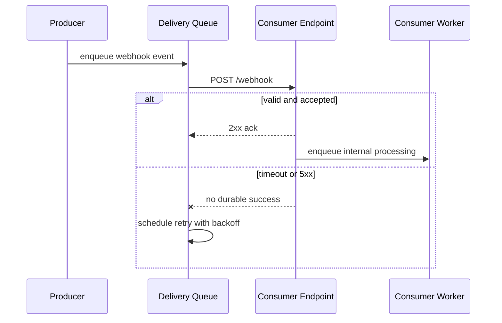

# Webhooks

## 1. Overview

A webhook is a push-based integration mechanism in which one system sends an HTTP request to another system when a relevant event happens.

At first glance, a webhook looks deceptively simple:

- something happens
- the producer sends an HTTP POST
- the consumer receives it

That simplicity is real at the interface level and misleading at the system-design level.

The moment one system starts delivering business-significant events into another system's HTTP endpoint, the producer takes on a delivery problem and the consumer takes on an ingestion problem.

The producer now has to answer:

- what counts as delivered
- how long to wait for a response
- when to retry
- how to sign requests
- how to observe failures

The consumer now has to answer:

- how to verify authenticity
- how to survive duplicates
- how to avoid doing expensive work inline
- how to recover from backlog or endpoint outages

This is why webhooks are one of the most common integration patterns and one of the most underestimated.

They sit at the boundary between:

- APIs
- eventing
- retries
- security
- operational reliability

When designed well, webhooks are a practical way to notify external or internal consumers in near real time without forcing constant polling. When designed poorly, they create duplicate processing, invisible delivery failures, and security exposure through one of the most externally reachable surfaces in the system.

## 2. The Core Problem

Many integrations need timely notification when something changes.

Examples:

- payment succeeded
- subscription renewed
- order shipped
- build finished
- invoice failed
- user invited

The simplest way for a consumer to learn about that change is polling:

- ask every minute
- ask every five seconds
- ask after every user action

Polling has clear drawbacks:

- wasted requests when nothing changed
- delayed awareness when something did change
- high cost at scale
- poor real-time behavior

Webhooks exist because producers often know exactly when something meaningful happened. It is more efficient for the producer to push a notification than for every consumer to ask repeatedly.

But that efficiency moves the complexity.

With polling, the consumer owns timing and retries.

With webhooks, the producer owns delivery attempts and the consumer must expose a stable publicly reachable endpoint. That changes the failure model:

- the consumer may be down
- the consumer may be slow
- the consumer may return success before it actually finished its business logic
- the network may fail after the request left the producer but before the producer saw the response
- the same event may be retried many times

So the real problem webhooks solve is not "how to send an HTTP callback."

The real problem is:

How do two independent systems coordinate event notification over an unreliable network without assuming synchronous trust, perfect uptime, or exactly-once delivery?

## 3. Visual Model

What to notice:

- durable delivery usually requires some producer-side queueing or retry state
- the consumer should acknowledge quickly and process asynchronously where possible
- a network-level success signal is not the same thing as full business completion

## 4. Formal Statement

A webhook is an outbound HTTP callback initiated by a producer to notify a consumer-controlled endpoint about an event or state change.

A serious webhook design needs to define:

- event payload format
- endpoint contract
- authentication or signature rules
- response semantics
- retry policy
- timeout limits
- replay and duplicate handling
- observability for failed and delayed deliveries

The key architectural fact is that webhook delivery is usually at-least-once, not exactly-once.

That means both sides must be designed with ambiguity in mind.

The producer may not always know whether the consumer processed the event.

The consumer may receive the same event more than once.

Once those two statements are accepted, the rest of the design becomes much more disciplined.

## 5. Key Terms

### 5.1 Callback Endpoint

The HTTP URL exposed by the consumer to receive notifications.

This is not just an API route. It is an ingestion boundary for externally initiated events.

### 5.2 Delivery Attempt

One producer attempt to send the webhook.

A single event may generate multiple delivery attempts over time.

### 5.3 Idempotent Consumer

A consumer that can safely handle the same event more than once without creating duplicate side effects.

This is one of the most important webhook properties.

### 5.4 Signature Verification

A cryptographic mechanism used by the consumer to confirm that the request was sent by the expected producer and was not modified in transit.

### 5.5 Retry Policy

The producer's rule for reattempting delivery after timeouts, connection failures, or non-success responses.

### 5.6 Dead Letter or Failure State

A terminal state for webhook deliveries that repeatedly fail beyond a configured retry budget.

### 5.7 Replay Protection

A way to detect and reject malicious or stale resubmission of signed requests that should no longer be accepted.

### 5.8 Thin vs Fat Webhook Payload

A thin webhook says "something changed" and often includes only an ID or small metadata.

A fat webhook includes enough business data for the consumer to act immediately.

Both models are useful. Both have tradeoffs.

## 6. Why the Constraint Exists

The producer and consumer are usually independently operated systems.

The producer does not control:

- the consumer's uptime
- the consumer's deployment quality
- the consumer's timeout behavior
- the consumer's database
- the consumer's security posture

That matters because webhook delivery crosses an organizational or service boundary where assumptions become much weaker.

Imagine a payment provider sending `payment_succeeded` to a merchant.

Several ambiguous states are possible:

1. The provider sends the request.
2. The merchant processes it successfully.
3. The success response is lost due to a network issue.
4. The provider retries.
5. The merchant receives the same event again.

From the provider's perspective, retrying was correct.

From the merchant's perspective, duplicate delivery is normal.

If the merchant's handler is not idempotent, it may:

- record the same payment twice
- trigger the same fulfillment twice
- send duplicate emails

Now consider the opposite failure:

1. The provider sends the webhook.
2. The merchant endpoint returns `200 OK`.
3. The merchant processes the event synchronously after sending the response.
4. The merchant crashes before persisting the effect.

From the provider's perspective, delivery succeeded.

From the merchant's business perspective, the event was effectively lost.

This is why webhook consumers should treat the callback endpoint as an ingestion boundary, not as a place to do long-running business work inline.

The constraint exists because HTTP request success and business success are not the same thing, and the network does not remove that ambiguity for either side.

## 7. Main Variants or Modes

### 7.1 Direct Event Payloads

The producer includes enough data in the webhook for the consumer to act immediately.

Examples:

- payment amount
- currency
- customer ID
- order ID
- event timestamp

Strengths:

- fewer follow-up calls
- simpler consumer flow
- lower dependency on producer API availability during processing

Costs:

- larger payloads
- more contract surface to version
- greater risk of exposing fields the consumer does not actually need

### 7.2 Thin Notifications

The producer sends a small payload, often just:

- event type
- object ID
- minimal metadata

The consumer then calls back to fetch canonical details.

Strengths:

- smaller payloads
- less event schema surface
- producer can keep one authoritative read API

Costs:

- extra round trip
- consumer now depends on both the webhook endpoint and a follow-up API call
- delayed processing under producer API degradation

This model is often cleaner when object state is large or fast-changing.

### 7.3 Batched Webhooks

The producer sends multiple events in one request.

Strengths:

- lower request overhead
- fewer callback attempts at high volume

Costs:

- more complex partial failure handling
- bigger payloads
- harder consumer retry semantics if one item fails and others succeed

### 7.4 Synchronous Validation Hooks

Some systems use webhook-like callbacks during a request flow for validation or approval.

Examples:

- admission checks
- custom authorization
- fraud or policy hooks

These are meaningfully riskier because the producer's critical path now depends on the consumer's response time and uptime.

They should be treated more like remote RPC with strict time budgets than like ordinary asynchronous event delivery.

### 7.5 Internal vs External Webhooks

Internal webhooks are used between systems within one organization.

External webhooks are sent to customer-managed endpoints or third-party platforms.

External webhooks usually require much more discipline around:

- compatibility
- visibility
- signing
- retry transparency
- support tooling

## 8. Supporting Mechanisms and Related Ideas

### 8.1 Idempotency

Webhook consumers must assume duplicates.

That usually means storing and checking:

- event ID
- delivery ID
- source object ID and event type

before performing side effects.

Idempotency is not a nice-to-have in webhook handling. It is foundational.

### 8.2 Retries and Backoff

Producers need bounded retry logic with backoff.

Without backoff:

- a down consumer gets hammered repeatedly
- overload worsens
- every transient error becomes a traffic storm

Without retries:

- transient failures become data loss

### 8.3 Queues and Delivery Workers

Reliable producers rarely send webhooks directly inline from the business transaction path.

They usually:

1. record the event durably
2. enqueue delivery
3. let workers perform callback attempts

That separation improves resilience and observability.

### 8.4 Signature Verification

Webhook endpoints are externally reachable and therefore attractive attack surfaces.

Consumers should verify:

- expected signature
- timestamp freshness
- source secret or key

before trusting payload content.

### 8.5 Observability

A mature webhook system tracks:

- delivery success rate
- retry count
- median and tail callback latency
- endpoint-specific failure patterns
- dead-letter accumulation
- consumer-specific disablement or pause state

Without these signals, the producer cannot tell whether integrations are healthy or quietly failing.

### 8.6 Event Versioning

Webhook payloads are contracts.

As the producer evolves fields and semantics, it needs versioning or compatibility discipline. Otherwise downstream consumers break silently.

## 9. Real-World Examples

### Payment Provider Notifications

Payment systems often use webhooks for:

- successful charges
- failed renewals
- refunds
- chargebacks
- settlement events

This makes sense because merchants need timely updates, and polling payment state continuously would be inefficient.

The tradeoff is that the merchant must build:

- signature verification
- durable ingestion
- duplicate handling
- replay-safe side-effect processing

### SaaS Account Lifecycle Events

SaaS platforms commonly send webhooks for:

- user invited
- user activated
- plan changed
- seat count exceeded
- invoice overdue

This allows customers to connect those events into their own automation systems.

The value is extensibility. The cost is that the SaaS platform is now operating an external event-delivery product, not just an HTTP endpoint.

### CI/CD Integrations

Source control or deployment tools often send webhooks when:

- a push occurs
- a pull request opens
- a pipeline finishes
- a release is published

These events work well as webhooks because consumers often want immediate reaction without polling for state every few seconds.

### Internal Event Bridge to Legacy Systems

Sometimes an organization has internal event streams but one downstream enterprise system can only receive HTTP callbacks.

Webhooks become a compatibility bridge between modern eventing and older integration models.

That can be practical, but it often requires more careful retry and observability controls because the receiving system may not be built for high-throughput event ingestion.

## 10. Common Misconceptions

### "A `200 OK` Means the Event Was Fully Processed"

Wrong.

It often only means the consumer accepted the callback request.

Good consumers return success only after durable acceptance, not necessarily after full business completion.

### "Webhooks Are Just HTTP APIs"

Not really.

They use HTTP as transport, but the operational model is event delivery:

- duplicates happen
- retries matter
- dead letters matter
- consumer availability matters

Treating webhooks like ordinary RPC is one of the most common design mistakes.

### "Webhooks Are Exactly-Once if the Producer Is Good Enough"

Wrong.

Networks and independent systems make exactly-once semantics impractical here. The safe assumption is at-least-once delivery with consumer idempotency.

### "IP Allowlisting Is Enough"

Usually not.

IP allowlisting can help, but it is not a strong substitute for signatures, timestamps, and request verification.

### "The Consumer Should Do Everything Inline"

Usually wrong.

Webhook endpoints should acknowledge quickly after validation and durable acceptance. Long business workflows belong behind that ingestion boundary.

## 11. Design Guidance

A good webhook system should be designed as an event delivery product, not an afterthought attached to an API.

### For Producers

Prefer:

- durable event creation before delivery
- queue-backed delivery workers
- bounded retries with backoff
- clear event IDs
- explicit delivery state
- signature support
- customer-facing observability if the webhook surface is external

Ask:

- what happens if the consumer is down for six hours
- what happens if the consumer returns `200` but loses the event internally
- can the consumer replay events
- can support teams inspect failure history

### For Consumers

Prefer:

- signature verification first
- very short request handler logic
- durable enqueue before acknowledging success
- idempotent downstream processing
- fast timeout budgets
- replay-safe side effects

Ask:

- what key identifies duplicates
- where is the delivery event stored before processing
- what happens if the worker crashes after partially handling the event
- how does the system audit which webhooks were applied

### When Webhooks Are a Bad Fit

Webhooks may be the wrong choice when:

- the consumer cannot expose a stable endpoint
- the event volume is so high that HTTP callbacks become inefficient
- the workflow requires strict synchronous guarantees
- the relationship is better modeled as a queue or shared event stream

### A Useful Heuristic

If the integration needs near-real-time notification across independently operated systems, webhooks are often a reasonable fit.

If the integration needs strict ordering, rich replay controls, consumer-managed offsets, or very high throughput, an event stream or queue may be a better abstraction.

## 12. Reusable Takeaways

- Webhooks are event delivery systems built on HTTP, not just "POST requests from one app to another."
- The producer owns delivery attempts; the consumer owns secure durable ingestion.
- At-least-once delivery should be the default assumption.
- Idempotency and signature verification are mandatory, not optional hardening.
- `200 OK` should mean durable acceptance, not necessarily full business completion.
- Thin payloads reduce contract size; rich payloads reduce follow-up reads.
- Good webhook platforms expose delivery status, retry behavior, and failure visibility.
- Poor webhook designs fail silently because transport success is mistaken for business success.

## 13. Summary

Webhooks are a practical push-based mechanism for notifying another system when something important has happened.

The benefit is timely integration without wasteful polling.

The tradeoff is that both sides must handle ambiguity:

- the producer cannot assume one attempt is enough
- the consumer cannot assume one delivery is unique

Once webhooks are treated as a delivery system with security, retries, and durable ingestion, they become much more reliable and much less surprising in production.
