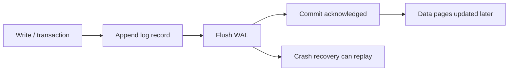

# Write-Ahead Logs

## 1. Overview

A write-ahead log, usually abbreviated WAL, is a durability mechanism in which changes are recorded in a sequential log before the system treats the corresponding update as committed in its primary data structures.

The idea is deceptively simple:

log first, then apply.

That simple ordering rule is one of the most important ideas in storage system design.

Why?

Because storage engines have to solve two difficult problems at once:

- survive crashes without losing committed work
- perform writes efficiently without rewriting complex data structures on every operation

The WAL is a major part of how they do both.

It gives the system a durable history of intended or committed change and allows the main storage layout to catch up later.

This matters far beyond one internal database implementation detail.

WALs influence:

- crash recovery
- replication
- checkpointing
- backup and restore
- write throughput

When engineers hear "WAL," they sometimes think only:

- crash recovery log

That is true and too narrow.

In many systems, the WAL is also:

- the source for replica shipping
- the basis of point-in-time recovery
- the ordering backbone for committed writes

So write-ahead logging is not just a storage trick. It is a core durability and sequencing model.

## 2. The Core Problem

Suppose a database needs to update:

- a table page
- an index page
- maybe another metadata structure

If it writes those structures in place directly, several problems appear.

What if the process crashes after updating one page but before updating the others?

What if the page write is torn or partial?

What if random writes to many structures are too expensive to sustain at high throughput?

The system needs some place where the authoritative fact:

"this change is committed"

can be recorded durably before all the slower or more complicated layout updates are finished.

That is the WAL.

The real problem the WAL solves is:

How can a storage engine make committed writes survive crashes while avoiding the cost and fragility of forcing every complex data structure update to complete synchronously before acknowledging success?

That is a much more important question than "where are the bytes written first."

## 3. Visual Model

What to notice:

- durability is established when the log is safely persisted, not when every page rewrite is done
- page application and checkpointing can happen later
- recovery works because the log preserves the committed sequence of change

## 4. Formal Statement

A write-ahead log is a persistent ordered record of changes in which the log records describing a write are durably written before the corresponding changes are considered committed relative to the primary storage structures they affect.

A serious WAL design has to define:

- record format
- ordering rules
- flush policy
- commit semantics
- checkpoint behavior
- replay and recovery logic
- retention and truncation policy

The important design principle is that write-ahead logging establishes a durable source of truth for committed change before the rest of the storage engine is fully updated.

## 5. Key Terms

### 5.1 Log Record

A log record is an entry describing some change, operation, or transactional step that the engine may need to recover or replicate.

### 5.2 Append

Appending means writing log records sequentially to the end of the WAL.

Sequential append is one of the main performance benefits of WAL-based design.

### 5.3 Flush

A flush forces buffered WAL data to stable storage so the system can treat it as durable against crash.

### 5.4 Commit

Commit is the point at which the system guarantees a write will survive crash according to its durability configuration.

In many WAL-based engines, that guarantee depends on log flush, not data-page flush.

### 5.5 Checkpoint

A checkpoint records that enough data pages have been persisted that recovery need not replay from the beginning of the log.

### 5.6 Replay

Replay is the act of reading WAL records after crash and applying the necessary changes to restore consistent committed state.

### 5.7 Group Commit

Group commit batches multiple transactions into one WAL flush cycle so the system amortizes expensive flush operations.

### 5.8 Log Sequence

Many systems use monotonic sequence positions so recovery, replication, and checkpointing can reason about progress through the WAL.

## 6. Why the Constraint Exists

Storage systems cannot have all of these for free at once:

- crash safety
- low latency
- arbitrary in-place updates
- zero coordination

If every commit required every affected page to be fully and safely rewritten before success, writes would often be much slower and more fragile.

The WAL exists because sequential durable append is usually much cheaper and easier to recover from than forcing all storage structures into their final form immediately.

Imagine a transaction modifying multiple records and indexes.

Without WAL:

- partial crash can leave structures inconsistent
- recovery has little durable sequence of intent
- write throughput is limited by random I/O and complex page management

With WAL:

- the engine records the change durably in order
- acknowledges when the log is safe
- applies page updates later
- replays after crash if needed

The constraint exists because durable ordering and final storage layout are not the same problem, and WAL intentionally solves them in that order.

## 7. Main Variants or Modes

### 7.1 Physical Logging

Physical logging records low-level page or byte-oriented changes.

Strengths:

- close to the storage layout
- efficient for page-oriented engines

Costs:

- harder to interpret semantically
- more tightly coupled to engine internals

### 7.2 Logical Logging

Logical logging records higher-level operations such as row insertions or transactional actions.

Strengths:

- easier to reason about conceptually
- useful in some replication and recovery designs

Costs:

- replay may require more engine logic
- not always as direct for low-level storage recovery

### 7.3 Redo-Oriented Logging

Some systems focus primarily on recording how to reapply committed changes after crash.

### 7.4 Undo or Mixed Recovery Models

Some engines combine WAL with mechanisms for undoing uncommitted work and redoing committed work.

The details differ by engine, but the design point remains:

the log is central to crash recovery semantics.

### 7.5 Group Commit

Multiple writers share one flush operation.

Strengths:

- much higher throughput
- better amortization of expensive fsync or durable flush cost

Costs:

- more complex latency behavior
- flush configuration becomes performance-critical

### 7.6 WAL Shipping for Replication

Some systems replicate by shipping WAL records to replicas.

Strengths:

- replicas follow the same committed write order
- efficient replication path

Costs:

- tight coupling between replication and WAL behavior
- lag and replay semantics become part of operational design

## 8. Supporting Mechanisms and Related Ideas

### 8.1 Crash Recovery

WAL is one of the core reasons a system can recover committed writes after a crash.

The engine replays enough durable log history to restore state.

### 8.2 Checkpointing

Without checkpoints, recovery could require replaying too much history.

Checkpointing reduces recovery time by establishing that older WAL portions are already reflected in persisted data pages.

### 8.3 Replication

In many databases, replicas follow the primary by applying WAL-derived changes.

This makes WAL part of the replication story, not just local durability.

### 8.4 Durability Tuning

Performance often depends on:

- when flush happens
- how often fsync happens
- whether group commit is enabled

These settings directly affect the safety/performance tradeoff.

### 8.5 Backup and Point-in-Time Recovery

Retained WAL segments often allow systems to reconstruct state up to a desired point in time between full backups.

### 8.6 Storage Engine Design

The meaning and structure of the WAL depend heavily on the storage engine architecture:

- page-oriented engines
- log-structured engines
- MVCC implementations

Understanding the WAL usually gives real insight into how the engine behaves under write pressure and crash recovery.

## 9. Real-World Examples

### Relational Databases

Databases such as PostgreSQL use WAL for:

- crash recovery
- replication
- point-in-time recovery

This is a strong example because the same durability mechanism supports several high-value operational features.

### Storage Engines with Group Commit

Many engines batch several commits into one flush cycle.

This shows why WAL is not only about correctness; it is also a key part of throughput optimization.

### Replicated Database Clusters

A primary may stream WAL-derived changes to replicas.

This keeps replicas aligned to the primary's committed order and demonstrates how WAL influences consistency and failover behavior.

### Message Brokers and Append Logs

Some brokers use append-first durable logs before acknowledging messages.

Even if the terminology differs, the same core idea is present:

make the ordered durable record of accepted work safe before relying on later materialization or downstream processing.

## 10. Common Misconceptions

### "The WAL Is Just for Recovery"

Wrong.

It is often also central to:

- replication
- backup
- durability tuning
- ordered commit behavior

### "Once Data Is in the WAL, It Must Already Be in the Main Data Files"

Wrong.

The whole point is that the log may be durable before the main data layout fully catches up.

### "WAL Removes the Need for Checkpoints"

Wrong.

Without checkpoints, recovery time can become too large and log retention costs can grow.

### "More Frequent Flushes Are Always Better"

Safer, often yes. Better overall, not always.

Frequent flushes may reduce throughput or increase latency substantially.

### "WAL Is Only a Low-Level Storage Detail"

Wrong.

Its behavior often affects:

- commit latency
- replica lag
- recovery time
- operational durability expectations

## 11. Design Guidance

The best way to think about WAL is:

What point in the write path actually means durable success?

That question forces clarity around commit semantics.

### Prefer

- explicit durability configuration
- good checkpoint strategy
- monitoring of flush latency and replay behavior
- understanding how replication depends on WAL progress

### Be Careful About

- assuming commit means all data pages are already updated
- underestimating recovery time without checkpoint tuning
- aggressive durability relaxation without understanding failure implications

### Questions Worth Asking

- when is a write considered committed
- what happens if the process crashes immediately afterward
- how much WAL must be replayed during recovery
- how are replicas fed and how far can they lag
- what is the throughput effect of flush frequency

### Practical Heuristic

If you want to understand a storage engine's write durability and crash behavior, understanding its WAL semantics will usually tell you more than reading the high-level marketing description.

## 12. Reusable Takeaways

- Write-ahead logging establishes durability by persisting log records before final storage structures fully reflect them.
- Sequential append is one of the main reasons WAL-based systems write efficiently.
- WAL underpins not only recovery but often replication and point-in-time restore.
- Checkpointing matters because durability and recovery speed are different concerns.
- Flush policy is where durability guarantees become concrete performance tradeoffs.
- WAL behavior is a window into how the storage engine actually works.

## 13. Summary

Write-ahead logs let storage systems make committed changes durable before every affected data structure is fully updated.

The gain is strong crash recovery, efficient sequential write behavior, and a durable ordered history that can also feed replication and restore workflows.

The tradeoff is that the engine must now manage:

- flushing
- replay
- checkpointing
- log retention

That trade is one of the foundational reasons modern storage systems can be both durable and performant.
